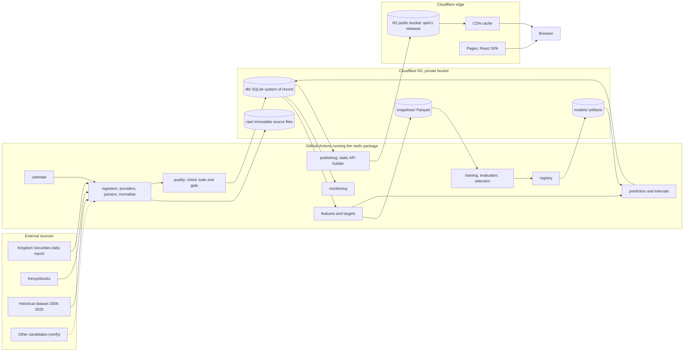
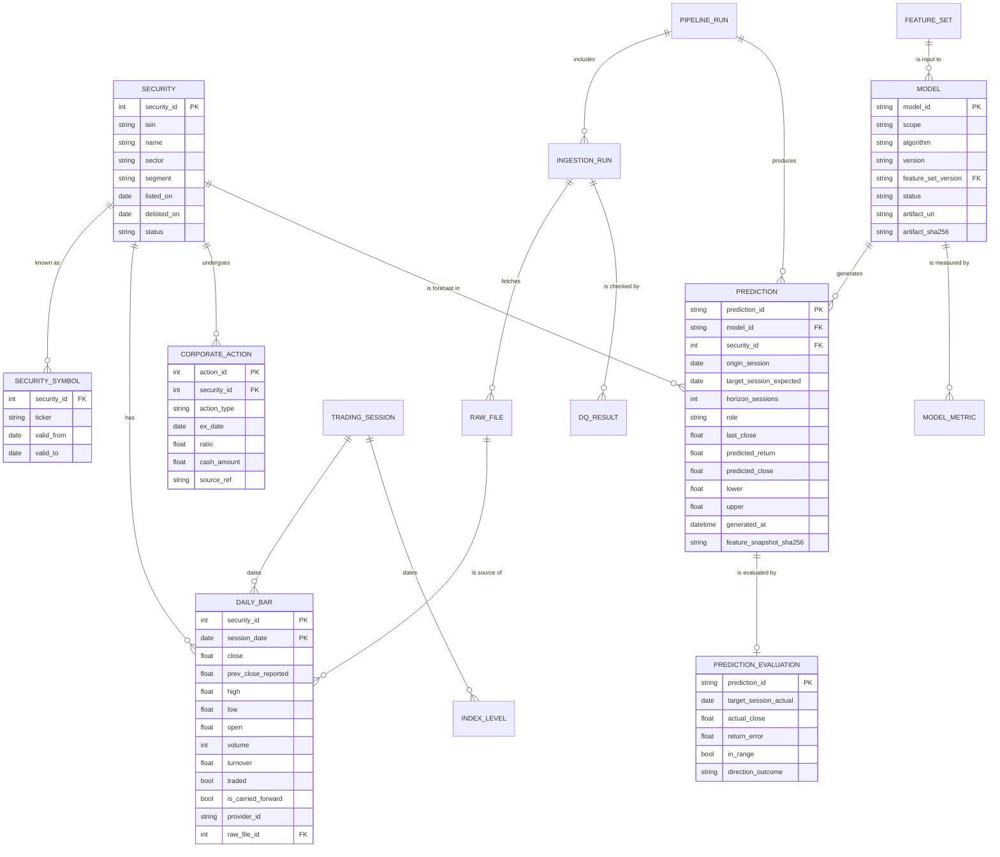
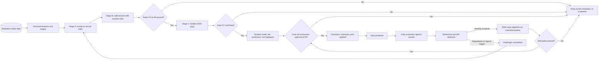
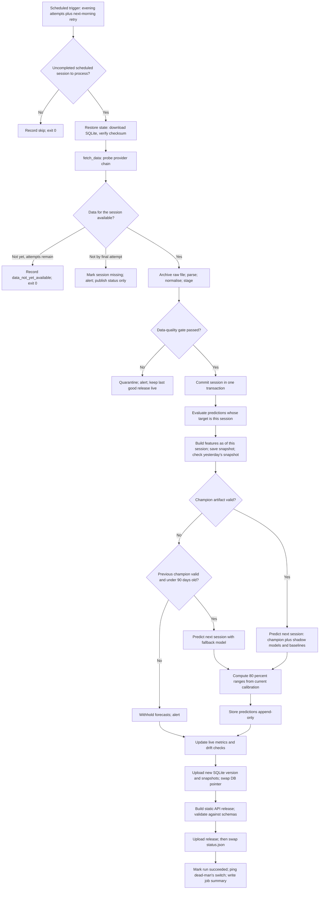
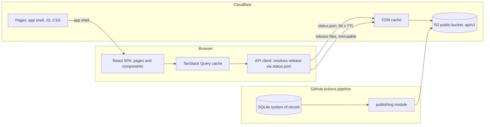
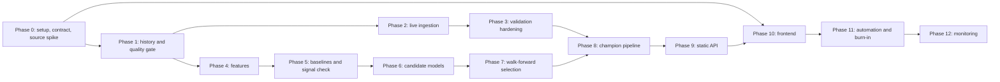

# NSE Daily Stock Prediction Platform

Engineering design document (`ENGINEERING.md`)

| | |
|---|---|
| Status | Draft 1.0, for implementation review |
| Date | 7 October 2026 |
| Owners | Platform (staff ML + staff software engineering), data engineering, product |
| Audience | The team implementing v1, and whoever maintains it afterwards |
| Decision log | Section 36 (ADRs). Deviations from the original brief are marked "Deviation from brief" where they occur |

**Verification note.** This revision was written without live web access. Every statement about a third-party source (URLs, formats, publication times, terms of use), a vendor's free tier, or an exchange rule is marked *(verify)* and is an explicit Phase 0 deliverable to confirm. The architecture does not depend on any single one of these facts being true; several decisions (provider abstraction, the closing-price-definition check, the legal gate before public launch) exist precisely because they may not be. The academic references in §15 are cited from memory and should be checked against the original papers.

Conventions used throughout: MUST / SHOULD / MAY carry their RFC 2119 meaning. **T** is the origin session, the latest completed NSE trading session whose data is used. **T+1** is the next NSE trading session after T, which is not necessarily the next calendar day. Session dates are local dates in Africa/Nairobi (EAT, UTC+3, no daylight saving). Prices are in KES.

---

## 1. Executive Summary

We are building a small system that ingests NSE end-of-day data every trading day, validates it, and publishes, for a set of liquid NSE equities, a forecast of the next session's closing price with an 80% expected range, alongside the model's honest track record. A minimalist web frontend lets users search for a stock, see market context (movers, index trend, market breadth, forecast track record) and read the forecast for that stock.

The central position of this document is that next-session stock-price forecasting is a low-signal problem, and the design should be shaped by that fact rather than by model sophistication. The most likely result of honest evaluation is that ML models beat a no-change forecast by a small margin, and part of that margin may be mechanical rather than economically meaningful: thin trading on the NSE and, if confirmed, a volume-weighted official closing price both induce autocorrelation in daily returns (Section 15). The design therefore puts data correctness, leakage-proof evaluation and transparent comparison against strong baselines ahead of model complexity. A baseline is allowed to be the production champion when nothing beats it. That outcome is a success of the evaluation framework, not a failure of the project.

### 1.1 Decisions at a glance

| Area | Decision | Where |
|---|---|---|
| Architecture | Modular monolith: one Python package (`nsefc`), one static web app, one repository | §6, ADR-001 |
| Serving | Static JSON API generated by the pipeline and served from a CDN; no always-on backend in v1 | §22, ADR-012 |
| Compute and scheduling | GitHub Actions cron, guarded by an external dead-man's switch | §21, §29, ADR-014 |
| Storage | SQLite system of record, immutable raw-file archive, Parquet snapshots, all in Cloudflare R2 | §11, ADR-002 |
| Data providers | Provider interface with pure, versioned parsers; primary and secondary chosen by a measured source spike; a provider swap is a data-contract event | §8, §9, ADR-003 |
| Target | Next-session simple return on corporate-action-adjusted close; price derived from it | §14, ADR-007 |
| Model scope | One global model pooled across the forecast universe, not one model per ticker | §13, ADR-006 |
| Candidates | Regularised linear model, LightGBM, CatBoost | §16, ADR-006 |
| Baselines | No-change (reference), drift, 5-session moving average, per-security AR(1); baselines are eligible champions | §15 |
| Validation | Staged walk-forward: tuning folds, monthly-refit selection walk-forward, touched-once lockbox, live shadow period | §17, ADR-008 |
| Primary metric | Mean absolute error of next-session return (equal to absolute price error as a percentage of last close), expressed as skill against no-change and tested for significance | §17 |
| Retraining | Daily inference only; monthly refit; quarterly challenger competition; every promotion goes through a reviewed pull request | §13, §18, ADR-009 |
| Intervals | Volatility-normalised split-conformal intervals on rolling out-of-sample residuals, 80% level | §19, ADR-010 |
| Registry | Registry table, content-addressed artifacts, and `config/champion.yaml` in git as the production pointer | §20, ADR-011 |
| Frontend | Vite + React + TypeScript single-page app, three routes, uPlot charts, mobile-first | §23, §24, ADR-013 |
| Cost | $0/month on free tiers, plus an optional domain (roughly $10–15/year) | §30 |

### 1.2 Deviations from the brief

The brief asked for challenge where warranted. These are the material deviations; each is justified in its section.

1. Daily *training* is replaced by daily *inference* plus a monthly refit. Refit frequency is measured in Phase 7 and is a configuration value, so daily refits remain available if they prove useful (§13.3).
2. The per-model `ticker` field generalises to `scope`, because v1 uses one global model (§13.2, §20).
3. XGBoost is replaced as a candidate by a regularised linear model, because XGBoost and LightGBM test the same hypothesis (§16.2).
4. "MAPE on returns" is rejected as a metric: it is undefined whenever the actual return is zero, which is common on the NSE (§17.6).
5. The selection walk-forward covers 2018–2023 rather than a single 2022–2023 block, so that candidate stability is judged across several market regimes (§17.2).
6. The gainers and losers endpoints merge into a single market overview resource, and search runs client-side over a small securities index (§22).
7. The data-quality gate is built in Phase 1 alongside historical ingestion rather than in Phase 3; live ingestion never runs without it (§34).
8. A legal and licensing gate is added before public launch (§8.5, §35).

### 1.3 Biggest risks

The three risks most likely to sink the project are, in order: the data sources (fragile free sources, unknown redistribution rights), the signal (models may add nothing beyond microstructure effects), and the historical dataset (unknown provenance, adjustment state and survivorship). The phase plan front-loads work that retires these risks before any significant ML or frontend investment (§34, §39).

---

## 2. Goals

| ID | Goal |
|---|---|
| GO-1 | **Correct data.** Every published number is traceable to an immutable raw source file and a passed data-quality gate. |
| GO-2 | **Honest forecasts.** Each forecast shows the next-session close, an 80% range, the model identity, the data timestamp and the model's track record against a no-change baseline. |
| GO-3 | **Leakage-proof, reproducible ML.** Any published prediction can be re-derived from the registry within numerical tolerance. |
| GO-4 | **Unattended daily operation.** The pipeline runs every NSE session without human action in the normal case, and fails closed and visibly otherwise. |
| GO-5 | **Replaceable data sources.** Changing a provider touches only the ingestion module and reference data. |
| GO-6 | **Minimal, fast, mobile-first UI.** Three routes; useful on a mid-range Android phone over a metered connection. |
| GO-7 | **Frugal and operable.** $0/month baseline, operable by one to three engineers with under two hours of routine operations per week. |

## 3. Non-Goals (v1)

The following are explicitly out of scope for v1. Adding any of them requires a new design review, not just a ticket.

Automated trading, order routing or broker integration. Buy, sell or hold recommendations, target prices or "signals". Intraday or real-time data and forecasts. Forecast horizons other than the next session (the schema is ready; the feature is not built). User accounts, watchlists, portfolios or notifications. Social features. Native mobile apps (the web app is mobile-first instead). Dashboard customisation. Bonds, ETFs, REITs and derivatives (ordinary equities only). Microservices, Kubernetes, streaming infrastructure, feature stores and multi-cloud deployment. Deep-learning models. SEO pre-rendering. Public bulk data downloads, which are also licensing-dependent.

## 4. Requirements

### 4.1 Functional requirements

| ID | Requirement | Section |
|---|---|---|
| FR-01 | Import the 2005–2025 historical dataset through the same normalisation and data-quality path as live data | §8.4, §9 |
| FR-02 | Ingest the latest NSE end-of-day data each session from a primary provider, with automatic fallback when the primary is unavailable | §9 |
| FR-03 | Backfill missing sessions, including 1 January 2026 to go-live, strictly in session order | §8.4, §9.2 |
| FR-04 | Block training, prediction and publication of new data when the data-quality gate fails | §10 |
| FR-05 | Maintain an NSE trading calendar and determine the next session | §7.5 |
| FR-06 | Compute leakage-safe features as of session T | §12 |
| FR-07 | Train and evaluate three candidate models and four baselines under walk-forward evaluation | §15–§17 |
| FR-08 | Select a single champion through documented gates; promotion requires review | §18 |
| FR-09 | Predict the next-session close and an 80% range for every security in the forecast universe | §13, §19 |
| FR-10 | Store predictions append-only with full lineage, and evaluate each once the actual is available | §20, §21 |
| FR-11 | Publish market data, movers, chart series and forecasts as a versioned static API | §22 |
| FR-12 | Frontend: search by ticker, company name or former name; homepage with movers and three charts; stock page with price chart, forecast and prediction history | §23, §24 |
| FR-13 | Expose pipeline status and data freshness publicly (status resource) and operationally (job summaries, alerts) | §25 |
| FR-14 | Monitor live performance and drift, and trigger challenger evaluation when warranted | §25.5 |

### 4.2 Non-functional requirements and performance targets

These targets are deliberately modest. None of them justifies optimisation work until it has been measured to be missed; correctness and reliability come first.

| ID | Attribute | Target |
|---|---|---|
| NFR-01 | Data freshness | Session T is live on the site within 45 minutes of the primary source publishing it, and by 22:00 EAT on T in the normal case |
| NFR-02 | Forecast timeliness | The forecast for T+1 is published before T+1 opens (09:00 EAT pre-open, *verify*) in at least 98% of sessions |
| NFR-03 | API latency | p95 time-to-first-byte under 150 ms from CDN cache at the Nairobi edge; under 600 ms on a cache miss |
| NFR-04 | Frontend load | Largest Contentful Paint under 2.5 s at p75 on a mid-range Android phone over 4G; initial JavaScript at most 150 KB gzipped; homepage data at most 60 KB compressed |
| NFR-05 | Search | Results render within 50 ms of a keystroke (client-side over roughly 70 securities) |
| NFR-06 | Daily ingestion | Under 5 minutes per session, including in-run retries |
| NFR-07 | Daily pipeline | Under 15 minutes end to end (no training in the daily path) |
| NFR-08 | Prediction generation | Under 60 seconds for the whole forecast universe |
| NFR-09 | Monthly refit | Under 45 minutes on a GitHub-hosted runner |
| NFR-10 | Full competition (Stages A–C) | Under 6 hours, parallelised by algorithm to fit the runner job limit, or run on a workstation |
| NFR-11 | Reliability | Pipeline succeeds without manual action in at least 95% of sessions; site availability equals CDN availability |
| NFR-12 | Reproducibility | Any published prediction can be re-derived within 1e-6 in return space from registry metadata and stored snapshots |
| NFR-13 | Cost | $0/month baseline |
| NFR-14 | Accessibility | WCAG 2.2 AA |

## 5. Assumptions

Each assumption has a verification step and a stated consequence if it turns out to be false. Assumptions A1–A3 are existential; they are verified first (Phase 0 and Phase 1).

| ID | Assumption | Verified by | If false |
|---|---|---|---|
| A1 | The 2005–2025 historical dataset exists, may be used for this purpose, and its provenance can be established | Phase 1 data audit | Rebuild history from alternative sources (§8.2); ML phases slip |
| A2 | At least one free source publishes complete end-of-day data for all listed equities on the evening of T | Phase 0 source spike over at least 10 sessions | Budget for a licensed end-of-day feed (§30) |
| A3 | We may store the data and display it publicly | Legal review before public launch (§8.5) | Run as a private research deployment, or license data |
| A4 | The NSE's official daily price is a volume-weighted average rather than a last trade *(verify)* | Exchange documentation, plus check VOL-02 (turnover ÷ volume ≈ close) | Baseline expectations and copy change; model structure does not |
| A5 | The NSE applies a daily price-movement band, commonly cited as ±10% *(verify)* | Exchange rules plus the empirical return distribution | Use empirical thresholds for data-quality checks and interval clipping |
| A6 | A forecast universe of roughly 20–30 sufficiently liquid equities exists | Phase 5 liquidity analysis | Smaller universe; fewer forecasts shown |
| A7 | GitHub Actions cron reliability is adequate (delays of minutes, rare misses) | Phase 11 burn-in, dead-man's switch | Move scheduling to a small VPS (§30) |
| A8 | Structured data stays small (well under 1 GB) | Trivially, from row counts | Move to Postgres earlier (§31) |
| A9 | Most users are on mobile, often on metered data | Analytics after launch | No change; layout is already mobile-first |
| A10 | The team is one to three engineers with limited operations time | Staffing | Simplicity choices can be revisited with a larger team |
| A11 | The historical dataset and the live sources share a price definition and adjustment basis | Phase 1 overlap reconciliation | Re-derive history, or segment training data by source basis |


---

## 6. System Architecture

### 6.1 Style

The system is a modular monolith: one Python package run as batch jobs, and one static single-page app. There is no long-running server in v1. Modules communicate through the database and typed in-process interfaces, never over a network. This is the simplest architecture that satisfies the requirements: data arrives once a day, all queries are enumerable in advance, and the whole structured dataset fits in memory.



### 6.2 Modules and dependency rules

| Module | Responsibility | May depend on | Must not depend on |
|---|---|---|---|
| `domain` | Core types (Security, Session, Bar, Prediction, enums); no I/O | nothing | everything else |
| `calendar` | Trading calendar and session arithmetic | domain | — |
| `storage` | Schema, migrations, repositories, object-store client | domain | business modules |
| `reference` | Securities master, symbols and aliases, corporate actions, adjustment factors | domain, storage | models |
| `quality` | Data-quality check suite, gate decision, reports | domain, calendar, storage, reference | features, models |
| `ingestion` | Providers, raw archive, parsers, normalisation, fetch orchestration | domain, calendar, quality, storage, reference | features, targets, models, training, prediction, publishing |
| `features` | Feature families, feature-set versions, as-of builder | domain, calendar, reference, storage | targets, models, training |
| `targets` | Target definitions; the only module allowed to look forward in time | domain, calendar, reference | models |
| `models` | `ForecastModel` implementations: baselines, linear, LightGBM, CatBoost | domain | storage, ingestion |
| `intervals` | Conformal calibrators | domain | — |
| `training`, `evaluation`, `selection` | Datasets, splits, tuning, walk-forward, metrics, statistical tests, promotion gates | features, targets, models, intervals, registry | ingestion, publishing |
| `registry` | Model metadata, artifacts, champion resolution | storage | training internals |
| `prediction` | Daily inference and live evaluation | features, models, intervals, registry, storage | training, ingestion |
| `monitoring` | Live metrics, drift checks, alerts | storage, evaluation metrics | — |
| `api` | Pydantic response schemas (the API contract); optional local FastAPI dev server | domain | — |
| `publishing` | Builds, validates and uploads static API releases | storage, api | models, features |
| `pipeline` | Orchestrates stages for daily, refit, competition and backfill runs | all of the above | — |
| `cli` | Typer command-line entry points | pipeline | — |

These rules are enforced in CI with `import-linter` contracts. Two matter most. `features` may not import `targets`, which makes the most common form of target leakage structurally impossible. `models` and `prediction` may not import `ingestion`, which keeps the ML layer independent of any data provider.

### 6.3 Runtime topology

GitHub Actions runs `nsefc` commands on a schedule. All durable state lives in two Cloudflare R2 buckets: a private one for raw files, the SQLite database, snapshots, artifacts, reports and logs, and a public one that holds only published API releases. The SPA is hosted on Cloudflare Pages. There is exactly one writer to production state: workflows in the `pipeline-prod` concurrency group. Developer credentials are read-only against production.

---

## 7. Data Architecture

### 7.1 Data zones

| Zone | Content | Format and location | Mutability | Producer |
|---|---|---|---|---|
| Raw | Source files exactly as fetched | Private R2 `raw/` (PDF, HTML, CSV) | Immutable, content-addressed by SHA-256 | ingestion |
| Staging | Parsed and normalised rows awaiting the data-quality gate | SQLite `staging_bar`, keyed by ingestion run | Transient; retained for quarantined runs | ingestion |
| Canonical | Validated bars, index levels, held sessions | SQLite | Append-only; corrections only via an audited command | ingestion, after the gate |
| Reference | Securities master, symbol history, aliases, sectors, corporate actions, holidays | Git (`reference/*.csv`, `config/calendar/*.yaml`), loaded into SQLite each run | Changed only by reviewed pull request | humans |
| Derived | Adjusted series, features, targets | Computed on demand; snapshots as Parquet in R2 | Snapshots immutable | features, targets |
| ML | Registry, artifacts, predictions, evaluations, metrics | SQLite and R2 `models/` | Predictions append-only | training, prediction |
| Serving | Static API releases | Public R2 `api/v1/` | Immutable releases plus one mutable pointer | publishing |

Reference data lives in git on purpose. It is small, changes rarely, and errors in it are expensive, so pull-request review gives an audit trail and a second pair of eyes for free.

### 7.2 Modelling decisions

**Stable identity.** Every security has an internal `security_id` that never changes. Tickers and names are attributes with validity intervals in `security_symbol`, because NSE counters do get renamed and re-ticketed (for example Barclays Bank of Kenya becoming Absa Bank Kenya, and the NIC/CBA merger forming NCBA, *verify dates*). Former names become search aliases. Provider-specific aliases (broker reports often print company names rather than tickers) live in `reference/provider_aliases.csv`.

**A complete panel.** The canonical table has one row per (security, session) for every session in which the security is listed and not suspended. A session with no trades is represented explicitly: `volume = 0`, `traded = false`, close equal to the last traded price, and `is_carried_forward = true` if the source omitted the row. Suspended periods have no rows and are recorded in reference data. Rolling features therefore count trading sessions consistently, and "no trade" is distinguishable from "missing data".

**Raw prices are the record.** Prices are stored exactly as published. Split, bonus and rights adjustments are applied when deriving series, via cumulative back-adjustment factors computed from `corporate_action`. Dividends are not adjusted out of prices, because the product forecasts the quoted price; ex-dividend sessions are flagged instead.

**Declared price basis.** Each provider declares its `price_basis` (`vwap`, `last` or `unknown`) and data-quality check PRV-02 enforces that the canonical series never silently mixes bases (§9.6).

**Horizon-ready.** Predictions carry `horizon_sessions` from day one (always 1 in v1). Adding the column now costs nothing; retrofitting it later means migrating history.

### 7.3 Entity model



Operational tables not drawn above: `staging_bar`, `session_ingest` (per-session commit status), `dq_override` (audited manual overrides), `pipeline_stage` (per-stage status within a run), `bar_conflict` (later source values that disagree with committed ones) and `calibration_set` (interval calibration versions).

### 7.4 Canonical daily bar

| Column | Type | Null | Notes |
|---|---|---|---|
| `security_id` | integer | no | Internal stable identifier |
| `session_date` | date | no | Local NSE session date; never derived from a timestamp |
| `close` | float64 | no | Official daily price as published (see A4); rounded to 4 dp at normalisation |
| `prev_close_reported` | float64 | yes | As printed by the source; may already be adjusted for corporate actions |
| `open` | float64 | yes | Not consistently published for the NSE *(verify)* |
| `high`, `low` | float64 | yes | Null on untraded sessions |
| `volume` | int64 | no | Shares traded; 0 when untraded |
| `turnover` | float64 | yes | KES value traded |
| `deals` | int64 | yes | Number of trades, if published |
| `traded` | bool | no | `volume > 0` |
| `is_carried_forward` | bool | no | Row synthesised for a listed security the source omitted |
| `provider_id` | text | no | Which provider supplied the committed row |
| `raw_file_id` | integer | no | Lineage to the archived source file |
| `ingestion_run_id` | integer | no | Lineage to the ingestion run |
| `ingested_at` | timestamp (UTC) | no | Commit time |

Primary key `(security_id, session_date)`. Storage-level CHECK constraints duplicate the most important data-quality rules (`close > 0`, `volume >= 0`, `high >= low`) as defence in depth.

### 7.5 Trading calendar and session semantics

**Source of truth.** `config/calendar/nse_holidays.yaml`, versioned in git. It contains fixed-date public holidays (1 January, 1 May, 1 June Madaraka Day, 20 October Mashujaa Day, 12 December Jamhuri Day, 25 and 26 December), Good Friday and Easter Monday computed from the Easter date, Idd-ul-Fitr (entered as provisional ahead of time and confirmed when gazetted, because it depends on moon sighting), the rule that a holiday falling on a Sunday is observed on the Monday, any other day gazetted under the Public Holidays Act *(verify the current list)*, and ad-hoc gazetted closures such as the 9 August 2022 general-election holiday. Every entry records its source reference.

**Interface.** `is_scheduled_session(d)`, `next_session(d)`, `previous_session(d)` and `sessions_between(a, b)`. Every other module uses these; nobody computes "tomorrow" with date arithmetic.

**History.** For 2005–2025, a date is a held session if and only if the historical data shows market activity on it. Disagreements between the rule-based calendar and the data are listed in the Phase 1 audit and resolved by hand.

**Live reconciliation.** A scheduled session with data is recorded as held. A scheduled session with no data from any provider by the final attempt is recorded as `missing` and raises an alert; a human classifies it as an unscheduled closure (added to the calendar by pull request) or a source outage (backfilled later). Data arriving for an unscheduled date is a data-quality error (DAT-02), most likely a mis-dated report.

**Forecast semantics.** A forecast is for "the next session after T", not for a calendar date. The prediction stores `target_session_expected` from the calendar at prediction time; evaluation binds to the first held session after T (`target_session_actual`) and sets `target_shifted` if the two differ. For example, the forecast made after Monday 19 October 2026 targets Wednesday 21 October 2026, because Tuesday 20 October is Mashujaa Day; the UI says "Forecast for Wed 21 Oct".

**Time handling.** Scheduling runs in UTC; session dates are stored as plain local dates and are never produced by converting a timestamp, which avoids the classic off-by-one where a UTC-midnight timestamp is rendered in EAT.

---

## 8. Data Sources

### 8.1 Principles

No source is assumed permanent. Live operation uses at least two independent sources: a primary and a validating fallback. The primary is chosen by measurement, not reputation. Every fetched file is archived before parsing. Legality is a gate, not a score.

### 8.2 Candidate inventory

Everything in this table must be confirmed in the Phase 0 spike.

| Source | Proposed role | Expected content and format | Strengths | Risks |
|---|---|---|---|---|
| Kingdom Securities daily market report | Primary candidate (from brief) | Equity prices, volumes, index levels; likely PDF *(verify)* | Curated daily by a licensed broker | PDF layout drift; publication time; redistribution terms; may list company names rather than tickers |
| KenyaStocks | Secondary and validation candidate (from brief) | Daily prices *(verify the exact site, fields and format)* | Independent cross-check | Unknown stability and terms |
| NSE official website (daily price lists, market statistics) | Candidate primary or validator | Official prices, volumes, indices; HTML or PDF *(verify)* | Authoritative | Terms of use; exchange data licensing for redistribution |
| AFX market data (afx.kwayisi.org/nse) | Candidate validator and backfill source | Per-security daily price history and volume; HTML tables *(verify)* | Simple, stable structure; history pages | Single maintainer; terms |
| MyStocks (mystocks.co.ke) | Candidate backfill source | Historical prices; HTML *(verify)* | Long history | Terms; scraping restrictions |
| Mendeley Data and Kaggle NSE datasets | Historical backfill and cross-check | Daily prices over fixed ranges; CSV or XLSX | Explicit licences (often CC BY, *verify per dataset*) | Coverage gaps; unknown adjustment; static |
| Existing 2005–2025 dataset | Historical foundation | Daily bars *(format to confirm)* | Already available | Provenance, adjustment state and survivorship unknown |
| Central Bank of Kenya and Capital Markets Authority publications | Low-frequency validation | Index levels, market capitalisation (weekly or quarterly); KES exchange rates (CBK) | Official | Too infrequent for daily ingestion |
| Other brokers' daily reports | Tertiary fallback | Daily prices; mostly PDF | Redundancy | Same PDF risks |

Excluded: Yahoo Finance (NSE Kenya coverage absent or unreliable, *verify*), Investing.com (terms prohibit scraping), and paid vendors (outside the v1 budget; listed in §30 as the upgrade path).

### 8.3 Source verification spike (Phase 0)

For at least 10 consecutive sessions, every candidate is observed and recorded: first-seen publication time in EAT; completeness (share of listed equities, fields present); parse effort; agreement with the other sources on close and volume; archive availability (can sessions back to 1 January 2026 be fetched?); robots.txt and terms of use; the price basis (VWAP or last trade) and whether the printed previous close is corporate-action-adjusted.

Sources that fail the legality review are excluded. The remainder are scored: completeness 30%, timeliness 25%, parse robustness 20%, history and archive depth 15%, stability and track record 10%. The output is `docs/sources/source-evaluation.md` and an update to ADR-003 naming the primary and secondary providers.

### 8.4 Historical backfill

1. **Audit the existing 2005–2025 dataset**: provenance and licence; coverage per security-year; adjustment state (inspect price jumps around known corporate actions); survivorship (are delisted and long-suspended securities present?); price basis; ticker mapping.
2. **Reconcile against an independent source**, sampling at least 50 security-sessions per year.
3. **Fill gaps** from openly licensed datasets, recording `provider_id` per row.
4. **Backfill 1 January 2026 to go-live** from provider archives. Today's date is 7 October 2026, so this gap is already about 190 sessions; if no archive covers it, the gap is recorded as `missing` and handled explicitly rather than papered over.
5. Everything passes through the same ingestion path and data-quality gate as live data, using an explicit `historical` check profile where thresholds legitimately differ.

### 8.5 Legal and licensing gate

Being able to read a public page is not a licence to republish its contents. NSE market data is commercially licensed through the exchange's data services *(verify the terms for end-of-day redistribution)*, broker reports are copyrighted documents usually issued for clients' information, and aggregator sites have their own terms. Publishing forecasts may also touch Capital Markets Authority rules on investment advice *(verify)*; the language rules in §24.7 reduce that risk but do not replace legal advice.

Decision: v1 may be built and operated privately. Public launch requires written legal sign-off on storage and display rights per source, attribution requirements and disclaimer wording (criterion MVP-20, §35). The cheapest robust resolution may well be an end-of-day data licence from the exchange or a vendor, which would also remove most ingestion fragility.

Scraping etiquette applies to every provider: an identifying User-Agent with a contact address, robots.txt honoured, at most one request per second per host, conditional GETs, and no re-fetching of anything already archived.

---

## 9. Data Ingestion

### 9.1 Provider contract

```text
DataProvider (protocol)
  provider_id: str                         e.g. "kingdom", "kenyastocks", "historical_file"
  price_basis: "vwap" | "last" | "unknown" declared; verified by data-quality checks
  capabilities: fields provided, supports_range, archive_from, typical_publish_time_eat

  latest_available_session() -> SourceAvailability
      Cheap probe: session_date, source_timestamp, locator (URL or key).
  fetch(session_date) -> RawArtifact
      I/O only: bytes, content_type, url, fetched_at, HTTP metadata.
      Raises NotYetPublished or ProviderUnavailable.
  fetch_range(start, end) -> iterator of RawArtifact
      Default implementation loops over calendar sessions; override when bulk history exists.
  parse(artifact) -> ParsedReport
      Pure function of bytes and parser_version. Raises LayoutUnrecognized.
  normalize(report, context) -> canonical bars, index levels, normalisation issues
      Maps names or symbols to security_id through aliases; converts units and types.
```

The brief's `fetch_latest()` is `latest_available_session()` followed by `fetch()`, and `get_source_timestamp()` is `SourceAvailability.source_timestamp`. Fetching and parsing are separated deliberately: the raw archive is the durable truth, and parsers are pure functions over it. When a layout problem is discovered days later, the parser is fixed and re-run over archived files (`nsefc ingest reparse`) without touching the source again.

Initial implementations: `HistoricalFileProvider` (the existing dataset, and any openly licensed backfill files), `KingdomProvider`, and `KenyaStocksProvider`. Further providers (NSE official, AFX, MyStocks) are added only if the Phase 0 spike scores them well.

**Fallback policy.** The provider chain is ordered per environment. The pipeline falls back to the next provider for *availability* failures (not yet published, unavailable after retries, layout unrecognised), never for *disagreement*. If the primary's data parses but fails a value-level check, the pipeline compares it against the secondary instead of substituting it. If the secondary agrees on the flagged rows, the anomaly is probably real (for example an unrecorded corporate action) and the rows are quarantined for review; if it disagrees, the primary is wrong and the session is quarantined with an alert. A human resolves both cases, because silently swapping sources could mask a real market event or adopt the worse source.

### 9.2 `fetch_data.py` specification

`scripts/fetch_data.py` is a thin entry point equivalent to `nsefc ingest fetch`; the logic lives in `nsefc.ingestion.service`. It is safe to run any number of times.

Arguments: `--as-of DATE` (default: the latest scheduled session on or before today in EAT whose close has passed), `--providers` (default: the configured chain), `--backfill-from DATE`, `--reparse RAW_FILE_ID`, `--dry-run` (no commits), `--env`.

Responsibilities, in execution order:

1. **Latest stored session**: the maximum `session_date` with `session_ingest.status = committed`.
2. **Latest available source session**: `latest_available_session()` across the provider chain.
3. **Sessions to fetch**: calendar sessions in (latest stored, min(as-of, latest available)], in order. If none, exit with code 10.
4. **Download and cache raw files**: reuse an archived file if one exists for (provider, session); otherwise fetch it and store it content-addressed with a `raw_file` row before anything else happens.
5. **Parse** with the provider's parser, recording `parser_version` and the layout fingerprint.
6. **Normalise** to the canonical schema: symbol mapping, types, units, explicit carried-forward rows for listed securities the source omitted.
7. **Validate** by invoking the data-quality suite (§10) on the staged rows. The check logic lives in `quality`, not here.
8. **Deduplicate**: identical duplicates are dropped and logged; conflicting duplicates are a data-quality error.
9. **Commit** only valid records, in one transaction per session: insert-if-absent into `daily_bar` and `index_level`, then mark `session_ingest` committed. Otherwise quarantine.
10. **Log** an `ingestion_run` row, `dq_result` rows, structured log events and job-summary lines.
11. **Fail safely**: stop at the first session that does not commit. Sessions are committed strictly in order, so a failure never leaves a hole followed by later data. Nothing is ever partially committed.

| Exit code | Meaning | Orchestrator action |
|---|---|---|
| 0 | At least one new session committed | Continue the pipeline |
| 10 | No new session available yet | Stop quietly; the next scheduled trigger retries |
| 20 | Data quarantined by the quality gate | Stop; alert; no prediction |
| 30 | All providers unavailable after retries | Stop; alert only on the final attempt of the day |
| 40 | Configuration or reference-data error (for example an unmapped security) | Stop; alert |
| 1 | Unexpected error | Stop; alert |

**Boundaries.** `fetch_data.py` MUST NOT build features, train, predict, publish, or contain model-specific or frontend logic. It writes only to the raw archive, the staging and canonical market tables, and the ingestion and data-quality logs. It does not decide whether a prediction is made; the pipeline decides that from its exit code.

### 9.3 Parsing PDFs safely

PDF reports are the most fragile input in the system, so parsers are strict rather than clever. Tables are extracted with `pdfplumber` using explicit column anchors. Each report gets a layout fingerprint: a hash of the normalised header tokens and column order. An unknown fingerprint raises `LayoutUnrecognized`; there is no "best effort" mode. Numbers are parsed with explicit rules for thousands separators, dashes meaning nil or no trade, and parenthesised negatives. Every parser version has golden-file tests built from archived samples. When a new layout is confirmed, a new parser version is added and the old one is kept for reparsing historical files.

### 9.4 Symbol mapping

Providers map their symbols or company names to `security_id` through `reference/provider_aliases.csv`. An unmapped symbol is a warning for that row; three or more in one report is a batch error, because it usually means a column shift or a layout change rather than three new listings. New listings are added to the securities master by pull request.

### 9.5 Retries

Within a run, timeouts and 5xx responses are retried three times per provider with exponential backoff and jitter (about 2 s, 8 s and 30 s). "Not yet published" and 404 responses are not retried within the run; the next scheduled trigger handles them (§21.3).

### 9.6 Replacing a provider

Swapping a provider at the code level means adding a class and changing configuration. Swapping it at the data level is a contract event, because a different source may define the price differently (VWAP versus last trade) or adjust previous closes differently, which silently shifts the target distribution the model was trained on. A new provider therefore runs in shadow ingestion for at least 10 sessions. It is promoted to primary by pull request only after it agrees with the current primary for at least 99% of overlapping securities (close within 0.5%, volume exact where both report it) and declares the same price basis. Downstream code never changes.

---

## 10. Data Validation

### 10.1 Severity model

ERROR blocks the scope it applies to; WARN is committed but logged and surfaced; INFO is recorded only. A row-scope ERROR quarantines that row, which withholds that security's forecast. A batch-scope ERROR quarantines the whole session, which withholds all forecasts and keeps the previous release on the site.

### 10.2 Check catalogue

| ID | Check | Scope | Severity |
|---|---|---|---|
| SCH-01 | Required columns for the provider's declared fields are present | batch | ERROR |
| SCH-02 | Values parse to the expected types | row | ERROR |
| SCH-03 | Symbol maps to a known security | row | WARN; batch ERROR at 3 or more |
| SCH-04 | Layout fingerprint is known | batch | ERROR |
| DAT-01 | Report date parses and equals the requested session | batch | ERROR |
| DAT-02 | Session is a scheduled trading day | batch | ERROR |
| DAT-03 | No conflicting duplicates per (security, session) | row | ERROR; identical duplicates dropped (INFO) |
| DAT-04 | Session is the next expected session after the last committed one (no holes, no reordering) | batch | ERROR |
| DAT-05 | Report is not a re-dated copy of the previous session (at least 95% of closes *and* volumes identical) | batch | ERROR |
| DAT-06 | No scheduled session older than the current one lacks committed data | history | WARN; ERROR after the final attempt |
| PRC-01 | Close is positive; open, high and low positive when present | row | ERROR |
| PRC-02 | low ≤ min(open, close), high ≥ max(open, close), high ≥ low | row | ERROR |
| PRC-03 | Absolute move versus previous close within the price band plus 0.5 percentage points, unless a corporate action is recorded | row | ERROR (quarantine row) |
| PRC-04 | Reported previous close equals our stored previous close (adjusted if a corporate action applies), within KES 0.01 | row; batch above 10% of rows | WARN; batch ERROR |
| PRC-05 | Untraded security (volume 0) has close equal to previous close | row | WARN |
| PRC-06 | Fewer than 20% of securities breach PRC-03 | batch | ERROR |
| VOL-01 | Volume is a non-negative integer | row | ERROR |
| VOL-02 | Turnover non-negative; where volume and turnover both exist, turnover ÷ volume lies within [low, high], and is approximately the close when the basis is VWAP | row | WARN |
| VOL-03 | Volume at most 50 times its trailing 60-session median | row | WARN (block trades happen) |
| MKT-01 | At least 95% of active (listed, not suspended) securities present | batch | ERROR |
| MKT-02 | Every forecast-universe security present | row; batch above 10% of universe | ERROR (withhold); batch ERROR |
| MKT-03 | Configured index levels present, with daily change within ±15% | batch | WARN if missing; ERROR if implausible |
| MKT-04 | Cross-source agreement: at least 95% of overlapping securities within 0.5% on close | batch | ERROR; per-row WARN |
| MKT-05 | Advancers + decliners + unchanged equals securities present | batch | ERROR |
| MKT-06 | Unexpected new or missing tickers versus the securities master | batch | WARN |
| PRV-01 | Raw file archived with SHA-256 and parser version recorded before commit | batch | ERROR |
| PRV-02 | Provider's declared price basis matches the canonical series' basis | batch | ERROR |

Three checks deserve emphasis because they catch the failures that would otherwise be silent. DAT-05 catches a source republishing yesterday's report under today's date, which looks perfectly valid row by row. PRC-04 catches column shifts that produce plausible but wrong numbers. VOL-02 doubles as an empirical test of assumption A4: if turnover ÷ volume consistently equals the published close, the close is a VWAP.

### 10.3 Gate semantics

A session commits only if no batch-scope ERROR fires. Rows with row-scope errors are excluded and listed in the session's quarantine record, and forecasts for those securities are withheld. Market-level features are computed only when MKT-01 passes; if it fails, no forecasts are produced for any security that session, because a market feature computed on a partial cross-section in production would differ from the complete cross-sections the model was trained on.

### 10.4 How errors surface

Every check writes a `dq_result` row (check id, severity, status, affected keys, details). The GitHub Actions job summary shows a results table. A failure opens or updates a GitHub issue keyed by (session, check id), with links to the archived raw file and the cross-source diff. The public status resource carries only a generic message ("Data for 7 Oct is delayed: validation hold"), and the site keeps serving the last good release, showing a stale-data banner once the freshness deadline passes (§22.4).

### 10.5 Resolution runbook

The on-call engineer classifies the failure and takes one of four paths. A parser bug gets a fix, a new parser version and `nsefc ingest reparse`. A missing corporate action gets a pull request to `reference/corporate_actions.csv`, followed by a re-run. A genuine market outlier gets an override with `nsefc dq override --check PRC-03 --security ABC --session 2026-10-07 --reason "..."`, which writes an audited `dq_override` record; overrides are explicit and never silent. Bad source data waits for a corrected file, or is replaced by an explicit, recorded `--providers` choice.

### 10.6 Historical data

The same suite runs over 2005–2025 in batch mode and produces an audit report. Thresholds may be relaxed only through the named `historical` profile, never silently, and every relaxation is listed in the report.

---

## 11. Storage

### 11.1 Options considered

| Option | Strengths | Weaknesses | Verdict |
|---|---|---|---|
| CSV | Universal, human-readable | No types, no constraints, no transactions; easy to corrupt quietly | Interchange only |
| Parquet | Typed, compressed, columnar; ideal immutable snapshots | No transactions or constraints; awkward for small incremental updates | Snapshots and training sets |
| SQLite | Transactions, constraints, SQL, single file, zero operations, Python standard library | Single writer; not network-accessible | **System of record** |
| DuckDB | Excellent analytics over Parquet | Single writer; less suited to transactional upserts | Optional ad-hoc analysis tool |
| PostgreSQL | Concurrency, network access, mature tooling | Needs hosting: money, or free tiers that pause or expire | Migration target (§31) |

### 11.2 Decision

SQLite is the system of record for all structured data (reference data, bars, index levels, runs, data-quality results, registry, predictions, evaluations, metrics), using STRICT tables, foreign keys and CHECK constraints. Parquet holds immutable snapshots (feature snapshots, training sets). R2 holds raw files and model artifacts. Access goes through SQLAlchemy Core with Alembic migrations, so moving to Postgres later is a connection-string change plus testing rather than a rewrite.

The whole structured dataset is small: roughly 70 securities × 21 years × about 250 sessions is under 400,000 bar rows (well under 100 MB), plus about 60,000 prediction rows per year including shadow models. Raw PDFs add roughly 0.5 GB per year.

### 11.3 Object layout

```text
r2://nsefc-data  (private)
  raw/{provider}/{yyyy}/{session_date}/{sha256}.{ext}       immutable
  raw/{provider}/{yyyy}/{session_date}/{sha256}.meta.json
  db/versions/{timestamp}_{run_id}.sqlite.zst               immutable
  db/current.json                                           pointer: version, sha256
  snapshots/features/{feature_set_version}/{as_of}.parquet
  snapshots/training/{snapshot_id}.parquet
  models/{model_id}/model.{txt|cbm|json}, card.md, metrics.json, manifest.json
  reports/{competition|monitoring|dq}/...
  logs/{yyyy}/{mm}/{run_id}.jsonl

r2://nsefc-public  (public, behind a custom domain and CDN)
  api/v1/status.json                                        mutable pointer, short TTL
  api/v1/r/{release_id}/...                                 immutable releases
```

Two buckets keep the blast radius of a misconfiguration small: nothing in the public bucket is ever sensitive, and nothing sensitive can be made public by a path mistake.

### 11.4 Atomicity and concurrency

Each run downloads the current database version, works on a local copy, and at the end uploads a new immutable version, verifies it by reading back its SHA-256, and only then rewrites `db/current.json`. A run that crashes leaves the previous version current, so runs are atomic at run granularity without any database server. Before swapping the pointer, the run checks that `current.json` still names the version it started from and aborts otherwise. The GitHub Actions concurrency group is the primary mutual-exclusion mechanism; this check is defence in depth.

### 11.5 Retention and backup

| Data | Retention |
|---|---|
| Raw files | Forever |
| Database versions | Every version for 30 days, then the first of each month forever |
| Training snapshots | Forever while referenced by any registry entry |
| Feature snapshots | Two years |
| Logs | One year |
| Public releases | The last 30 |

Projected usage stays under about 3 GB after three years, within R2's free tier *(verify current limits)*. A restore drill (repoint `current.json` to an older version, run the pipeline, compare outputs) runs quarterly.

---

## 12. Feature Engineering

### 12.1 Principles

1. **Scale-free inputs.** Features are returns, ratios and normalised quantities, not raw price levels. The brief's lagged open, high, low and close are deliberately excluded as direct inputs: raw levels are non-stationary, differ by orders of magnitude across tickers (so they cannot be pooled), and tree models cannot extrapolate beyond the price range seen in training. Their information enters through ratios instead.
2. **As-of only.** Every feature for origin session T is a function of data with `session_date ≤ T` (§12.4).
3. **Sessions, not days.** Windows count trading sessions per security, never calendar days.
4. **Declarative and versioned.** Features are declared in `config/features/v1.yaml` (name, family, inputs, window, `min_periods`, transformation, nullability). `feature_set_version` is a hash of the specification plus the implementation version.
5. **Earned, not assumed.** A feature family enters production only after the evaluation in §12.3. Families that do not earn their place are removed; fewer features means fewer failure modes.
6. **One code path.** Training and serving both call `features.build(as_of=T)`. There is no separate online implementation to drift out of sync.

### 12.2 Candidate feature catalogue

| Family | Features | Notes |
|---|---|---|
| R: returns | `ret_k = ln(Cadj_T / Cadj_{T−k})` for k ∈ {1, 2, 3, 5, 10, 20, 60} | Short-term reversal and momentum; the most likely source of signal |
| T: trend and mean reversion | `dist_sma_n = C_T / SMA_n − 1` for n ∈ {5, 10, 20, 50}; `sma5_vs_sma20`; distance from 250-session high and low | Scale-free versions of the brief's moving averages |
| V: volatility | Rolling standard deviation of `ret_1` over 5, 20, 60; EWMA volatility (λ = 0.94); `(H_T − L_T) / C_T`; 14-session average true range ÷ close; 20-session Parkinson estimator | Also drives interval width (§19) |
| L: liquidity and volume | `log1p(volume_T)`; volume ÷ 20-session median; log turnover; share of the last 20 sessions with trades; sessions since last trade; 20-session Amihud illiquidity | Essential on the NSE, where many sessions have no trades and zero return |
| P: intraday position | `(C − L) / (H − L)`; gap `O_T / C_{T−1} − 1` | Only if high, low and open are reliably published *(verify)*; nullable |
| C: calendar | Day of week; month; `days_to_next_session` (known from the calendar at T) | Expected to be weak. The brief's "trading-session sequence" index is excluded: a monotonic time index lets trees memorise regimes and cannot extrapolate |
| X: market context | NASI return over 1, 5, 20 sessions (fallback: equal-weighted universe index); breadth `(advancers − decliners) / n` and its 5-session mean; market turnover relative to 20 sessions; 20-session market volatility; 5-session equal-weighted sector return excluding the security itself | Computed from our own cross-section where possible |
| S: static | Sector (categorical, point-in-time) | Ticker identity excluded by default (memorisation risk); tested only as an ablation |
| XS: cross-sectional ranks | Percentile rank of `ret_5` and `vol_20` within the universe at T | Optional; evaluated, not assumed |
| E: events (v2) | Ex-dividend or book closure at T+1; sessions since last corporate action | Known in advance, so not leakage; needs a reliable corporate-action feed first |

### 12.3 Feature-family evaluation

| Family | Expected predictive value | Leakage risk | Stability | Available at T | Cost |
|---|---|---|---|---|---|
| R | Medium | Low | Medium | Always | Trivial |
| T | Low to medium (overlaps R) | Low | Medium | Always | Trivial |
| V | Low for direction; high for magnitude and intervals | Low | High | Always | Trivial |
| L | Medium (explains zero-return sessions) | Low | High | Always | Trivial |
| P | Unknown | Low | Low (depends on source quality) | Source-dependent | Trivial |
| C | Low | Low | Low | Always | Trivial |
| X | Low to medium | Medium (completeness-dependent) | Medium | Only when MKT-01 passes | Low |
| S | Low | Low if point-in-time | High | Always | Trivial |
| XS | Low to medium | Medium (universe must be point-in-time) | Medium | Requires completeness | Low |

Selection procedure, run on the Stage A tuning folds (§17.2):

1. Start from the core set R + V + L.
2. Add each remaining family on its own. Keep it if mean MAE skill improves by at least 0.2 percentage points with a block-bootstrap 90% confidence interval excluding zero, or if it is needed for robustness (as L is for illiquid names).
3. Check that permutation importance, measured on held-out folds and never on training data, is stable across folds (Spearman rank correlation of at least 0.5).
4. Confirm live availability of at least 99% of prediction rows.
5. Record each decision in the feature-set changelog.

### 12.4 Leakage prevention

Leakage is treated as the most dangerous defect in the system because it produces results that look excellent. These rules are mandatory.

| Rule | Requirement |
|---|---|
| L1 As-of loading | Feature code receives data only through `load_panel(as_of=T)`, which filters to `session_date ≤ T` and asserts it. No feature function ever receives the full table. |
| L2 Only targets look forward | Negative shifts, `center=True`, back-fill and interpolation are banned in `features/` by a CI AST check. `features` cannot import `targets` (import-linter). |
| L3 Group before shift | Every shift and rolling operation is per `security_id` on a frame sorted by (`security_id`, `session_date`). Tests check that no value bleeds from one security into the next. |
| L4 Trailing windows only | Explicit `min_periods`; no centred windows; no forward-fill except the carried-forward prices already materialised in the canonical panel, and never across a suspension. |
| L5 Fit inside the fold | Stateless trailing features may be computed once over the panel. Anything fitted (scalers, imputers, winsorisation bounds, encoders, PCA) is fitted only on the training rows of each fold, inside a scikit-learn pipeline persisted with the model. |
| L6 Adjustment invariance | Features must be invariant to back-adjustment, which ratios and returns are. No feature may use adjusted price *levels*, because back-adjusted levels encode knowledge of future corporate actions. Volume and turnover are adjusted consistently with price. |
| L7 Point-in-time reference data | Universe membership, sector and listing status for date T are those known at T. Delisted and suspended securities stay in historical training data; there is no survivorship filter. |
| L8 Complete cross-sections | Market-context features use only session T's cross-section, and are computed only when MKT-01 passes (§10.3). |
| L9 Split hygiene | No random splits anywhere. Each training fold ends at least one session (the horizon) before its test block, so the last training label never references a test-period price. Hyperparameter tuning never sees Stage B or C periods (§17). |
| L10 Calendar-known future only | A feature about T+1 is allowed only if it is knowable at T from the published calendar, such as `days_to_next_session`. |
| L11 Feature snapshots | The exact feature vector behind every live prediction is persisted. The next day the pipeline recomputes features for T and asserts equality, which catches training-serving skew, nondeterminism and late source revisions. |
| L12 Plausibility tripwire | Skill or directional accuracy far above what is plausible (gate G8, §18.3) is treated as a leakage incident until proven otherwise. |

The tests that enforce these rules (truncation invariance, future perturbation, cross-security bleed, the random-walk null test, label alignment and the feature contract test) are specified in §27.2.

---

## 13. ML Strategy

### 13.1 Forecast universe

Forecasts are produced only for securities that trade often enough for a forecast to mean something. The rule lives in `config/universe.yaml` and is evaluated point-in-time each month: ordinary shares; traded on at least 80% of the last 250 sessions; median daily turnover over those sessions of at least KES 1 million; at least 500 sessions of history; not suspended. To stop names flapping in and out, a security leaves the universe only when it falls below 70% traded sessions or KES 0.5 million median turnover. These starting thresholds are calibrated in Phase 5 to give roughly 20–30 names.

All listed equities remain in the *display* universe (search, movers, price history). A security outside the forecast universe shows a reasoned empty state rather than a low-quality forecast (§24.6).

### 13.2 One global model

v1 trains a single model on pooled (security, session) rows from every security eligible at each date, rather than one model per ticker. Each ticker has only about 4,000–5,000 sessions, which cannot support a nonlinear model on a signal this weak. Pooling multiplies the training data roughly 25-fold, and the mechanisms we expect to matter (short-term reversal, liquidity effects, market moves) are shared across securities. Per-security differences enter through features such as volatility, liquidity and sector. A single model is also one artifact to operate, and it avoids the winner's curse of picking the best of several models separately for each ticker. This choice is validated rather than assumed: Phase 6 experiment E3 compares per-ticker LightGBM models against the global model under the same gates.

### 13.3 Three loops at three cadences

| Loop | Cadence | What happens | How results reach production |
|---|---|---|---|
| Inference | Every session | Build features, predict with the champion and shadow models, compute intervals, evaluate the previous forecast | Not applicable |
| Refit | Monthly (first session after month-end) and on demand | Same algorithm and hyperparameters, training window extended to the latest data | Refit gates, then a bot pull request, then human merge |
| Competition | Quarterly and when triggered | All candidates and baselines: tuning plus walk-forward | Full gates, shadow period, then a pull request |

Deviation from brief: daily retraining is not the default. One additional session adds well under 0.1% to the training set, while retraining every day adds daily model churn, more failure surface and harder-to-audit predictions for no measurable gain. Refit frequency is itself evaluated in Phase 7 by simulating daily, weekly and monthly refits over Stage B. If daily refits show a significant improvement, switching is a one-line configuration change (`refit.schedule: daily`).

### 13.4 Baselines are first-class

Baselines run in the same harness as candidates, produce stored shadow predictions every session, and are eligible to be champion. If nothing beats the no-change forecast under the gates, the no-change forecast ships, clearly labelled, with an honest empirical range.

### 13.5 Research code versus production code

Notebooks live in `research/` and may import `nsefc`; production code never imports research code. Any result used to make a decision must be reproducible through `nsefc` commands and recorded in a report under `reports/`.

---

## 14. Target Definition

### 14.1 Options

| Option | Formulation | Assessment |
|---|---|---|
| A | Next-session close (price level) | Rejected. Non-stationary and not poolable across tickers; tree models cannot predict outside the training price range; level metrics are dominated by persistence, so almost any sensible model reports R² close to 1 |
| B | Next-session simple return, `C_{T+1} / C_T − 1` | **Chosen.** Roughly stationary, poolable, bounded by the price band, and maps monotonically to price |
| C1 | Next-session log return | Equivalent at a one-session horizon (the difference is at most about 0.5 percentage points even at ±10%); preferred once multi-session horizons arrive, because log returns add up |
| C2 | Volatility-normalised return, `r / σ̂_T` | Run as experiment E5. Can stabilise pooled training, but depends on σ̂ quality and divides by near-zero volatility for illiquid names |
| C3 | Direction (up/down classification) | Rejected as primary. The product needs a price; it discards magnitude; zero-return sessions make the classes ill-defined |
| C4 | Return in excess of the market | Possible later. Removes the market component, but the product shows absolute prices, so a separate market forecast would be needed |

### 14.2 Definition

```text
y(i, T) = Cadj(i, T+1) / Cadj(i, T) − 1

  T+1   = next session after T at which security i is listed and not suspended
  Cadj  = official close adjusted for splits, bonus issues and rights issues (not dividends)

predicted_close(i, T+1) = C(i, T) × (1 + ŷ)    expressed in the price basis of session T
```

Edge cases are defined, not left to implementation. If the security does not trade at T+1, `y = 0`; the row is kept, because an unchanged price is exactly what will be reported. If it is suspended at T+1, there is no label and the row is excluded. Training labels are winsorised at ±(band + 2 percentage points) to blunt any residual data errors; evaluation is never winsorised. If a corporate action takes effect at T+1, evaluation happens in adjusted-return space and the displayed predicted close is converted to the new price basis.

### 14.3 What the point forecast means

The displayed predicted close is the model's conditional median. Tuning chooses between L1 and Huber objectives (with L2 available for completeness), and the primary metric is MAE, whose optimal forecast is the median. A useful consequence: because price is a monotone function of return, any quantile of the return forecast maps exactly to the same quantile of the price, so intervals carry over from return space to price space without approximation.

---

## 15. Baselines

| ID | Baseline | Forecast ŷ | Purpose |
|---|---|---|---|
| B0 | No change (naive) | 0, so predicted close = last close | Reference point for skill. The forecast to beat |
| B1 | Drift | Trailing 250-session mean return of the security | Tests whether "it usually goes up" explains apparent skill |
| B2 | Moving average | `SMA_5(T) / C_T − 1`, so predicted close = 5-session SMA | Requested in the brief; simple mean reversion |
| B3 | AR(1) | Per-security AR(1) on returns, fitted on the trailing 500 sessions at each refit | Captures autocorrelation from thin trading and, if A4 holds, from VWAP closes |
| B4 | ARIMA/ETS (diagnostic) | Automatic ARIMA per security | Reported once in Phase 5; not run daily, because it is expensive and rarely beats AR(1) for daily returns |

B3 is the baseline that matters most. Working (1960) showed that first differences of time-averages of a random walk have lag-one autocorrelation approaching 0.25, and non-synchronous trading adds more (Lo and MacKinlay, 1990). If the NSE close is a volume-weighted average, a no-change forecast is beatable for purely mechanical reasons. For calibration: with Gaussian returns and lag-one autocorrelation of 0.25, an AR(1) forecast gets the direction right about 58% of the time (0.5 + arcsin(0.25)/π) and reduces mean squared error by about 6% (ρ²). Numbers of that size can come from microstructure alone and must not be presented as evidence of a strong model. Beating B0 is necessary; beating B3 is what shows the ML adds something (gate G3, §18.3).

---

## 16. Candidate Models

### 16.1 The three candidates

| ID | Model | Hypothesis it tests | Key settings |
|---|---|---|---|
| M1 | Regularised linear regression (Ridge, with a Huber-loss variant) | The usable signal is mostly linear: reversal plus market context | In-fold imputation, scaling and winsorisation; regularisation strength tuned |
| M2 | LightGBM | Nonlinear interactions matter, for example reversal strength depending on liquidity or volatility | Objective chosen from L1, Huber, L2; shallow trees; large minimum leaf size; early stopping on an inner validation tail |
| M3 | CatBoost | As M2, but ordered boosting and symmetric trees often generalise better on small, noisy data; native handling of the sector categorical | Loss chosen from MAE, Huber, RMSE; depth 3–6 |

### 16.2 Why not XGBoost

Deviation from brief. LightGBM and XGBoost (histogram mode) are close implementations of the same idea; a comparison between them mostly measures defaults and tuning effort. A regularised linear model tests a genuinely different hypothesis and protects against complexity that is not paying for itself. The harness is model-agnostic, so adding XGBoost later costs one class and one configuration file.

### 16.3 Excluded model families

Deep learning (LSTMs, temporal convolutional networks, transformers) is excluded from v1: roughly 100,000–200,000 noisy rows with a weak signal is a high-variance regime for these models, reproducibility is harder, and there is no evidence they beat gradient boosting on data like this. Revisit only with materially more data, which in practice means intraday data, itself a non-goal. Prophet is designed for business seasonality, not returns. Per-security ARIMA is covered by baselines B3 and B4.

### 16.4 Indicative search spaces

Search spaces live in `config/models/*.yaml` and are deliberately small and regularisation-heavy, because the signal is weak and over-search is the main overfitting risk.

| Model | Parameters |
|---|---|
| M1 | Estimator ∈ {Ridge, Huber}; α ∈ [1e-4, 10] (log scale); Huber ε ∈ [1.1, 2.0] |
| M2 | Objective ∈ {l1, huber, l2}; learning rate ∈ [0.01, 0.1]; leaves ∈ [7, 63]; minimum data in leaf ∈ [100, 2000]; feature fraction ∈ [0.5, 0.9]; bagging fraction ∈ [0.5, 0.9]; L2 ∈ [0, 10]; up to 2,000 trees with early stopping |
| M3 | Loss ∈ {MAE, Huber, RMSE}; depth ∈ [3, 6]; learning rate ∈ [0.01, 0.1]; L2 leaf regularisation ∈ [1, 30]; up to 2,000 iterations with early stopping |

Tuning uses Optuna (TPE sampler) with a fixed budget of 40 trials per model and fixed seeds. Early stopping uses the last 10% of each fold's *training* window, never its test block. Determinism is configured explicitly: LightGBM with `deterministic=true` and a fixed thread count, CatBoost with a fixed `random_seed` and thread count, rows sorted deterministically before training, and CPU only.

---

## 17. Validation

### 17.1 Ground rules

There is no random splitting anywhere in the system. Every evaluation is chronological, every training window ends before its test window (with a one-session embargo, rule L9), and every prediction that counts as evidence is out-of-sample. Results are pooled across securities by session: the comparison statistic is the daily cross-sectional mean loss, which turns a panel of correlated errors into one time series that standard tests handle correctly.

### 17.2 Staged evaluation timeline

```text
2005 ........ 2011 | 2012 ..... 2017 | 2018 ............ 2023 | 2024 ... 2025 | 2026-01 .. go-live | go-live ->
training data only | Stage A         | Stage B                | Stage C       | Stage D            | Stage E
                   | tuning          | selection walk-forward | lockbox test  | pre-live holdout   | shadow, then live
                   | (annual folds)  | (monthly refits)       | (touched once)| (if backfilled)    |
```

| Stage | Period | Procedure | Used for |
|---|---|---|---|
| A: tuning | Test years 2012–2017 | Expanding-window annual folds (train 2005..Y−1, predict Y), as in the brief's example | Hyperparameters and feature-family selection only |
| B: selection | 2018-01 to 2023-12 | Frozen hyperparameters; walk-forward with a refit at every month-end, mirroring production (72 refits) | Candidate comparison, stability analysis, gates G2–G6 |
| C: lockbox | 2024-01 to 2025-12 | Same monthly-refit procedure, run once for the finalist, the runner-up and all baselines | Confirmation gate G7 |
| D: pre-live holdout | 2026-01 to go-live | Same procedure, if the backfill succeeded | Additional confirmation; never used for development |
| E: shadow and live | From go-live | Real daily predictions, stored but not displayed for at least 20 sessions | Gate G9 for MVP; ongoing evidence for challengers |

Deviation from brief: the brief's example used 2022–2023 as the validation period. Stage B covers 2018–2023 so that candidates are judged across several distinct market regimes (a 2018 sell-off, the 2020 COVID shock, recovery, and the 2022–2023 drawdown with currency stress) rather than one. Stage A precedes Stage B with no overlap, so the hyperparameters cannot have been chosen with knowledge of the selection period.

The lockbox is consumed once it is looked at. If the team changes anything after seeing Stage C results, 2024–2025 becomes development data, and the next competition must rely on Stage D and live shadow performance as its untouched evidence. Every access to lockbox results is logged in the competition report.

### 17.3 Expanding versus rolling windows

| | Expanding window | Rolling window |
|---|---|---|
| Advantages | Maximum data; stable estimates; retains rare regimes such as crashes | Adapts to structural change; drops stale market structure (for example pre-2008, before the market's current composition) |
| Disadvantages | Old relationships may no longer hold; slower to adapt | Less data, so higher variance; forgets crisis regimes; window length is another hyperparameter |

Decision: expanding window by default, with two alternatives evaluated as hyperparameters of the *training procedure* in Stage B: a rolling 5-year window, and expanding with exponential recency weights (half-life ∈ {2, 4, 8 years}). A configurable `training.min_start_date` lets the team exclude early years if the Phase 1 audit finds them unreliable. The choice is made empirically and recorded in ADR-008.

### 17.4 Simulating production faithfully

Stage B and C simulate exactly what production does: point-in-time universe membership, monthly refits with the selected window rule, the same interval calibration procedure, and the same data-quality exclusions. A backtest that differs from production in any of these is not evidence about production.

### 17.5 Metrics

Errors are measured in return space, `e = ŷ − y`. Absolute return error equals absolute price error divided by the last close, `|Ĉ − C_{T+1}| / C_T`, so "MAE%" in this document is both the statistically clean metric and the number shown to users ("average miss of 1.3% of price").

| Tier | Metric | Definition and use |
|---|---|---|
| Primary | **MAE skill vs no-change** | `1 − MAE_model / MAE_B0`, pooled over (security, session) in Stage B. Significance: one-sided Diebold–Mariano test on the daily cross-sectional mean loss differential with Newey–West variance (5 lags), confirmed by a moving-block bootstrap (block of 20 sessions, 2,000 resamples). This is the gate metric |
| Secondary | RMSE skill vs no-change | Sensitivity to large misses; out-of-sample R² relative to a zero forecast |
| Secondary | Directional accuracy | Share of correct signs on sessions where the actual close changed *and* the forecast is outside the ±0.1% "no meaningful change" band; always reported with that coverage and against trivial sign baselines (always-up, always-down, sign of last return) |
| Secondary | Interval coverage and width | Share of actuals inside the 80% range, mean range width, and the interval (Winkler) score, which penalises both misses and width |
| Secondary | Per-security skill distribution | Ticker-averaged skill and the share of securities with non-negative skill |
| Diagnostic | Bias | Mean signed error, overall and per security |
| Diagnostic | Price-space MAPE and sMAPE | For intuition and comparability; not used for decisions |
| Diagnostic | Breakdowns | By year, quarter, volatility regime (market-volatility terciles), liquidity bucket, day of week, ex-dividend sessions, untraded sessions |
| Diagnostic | Residual autocorrelation | Ljung–Box on residuals; structure left in residuals means a linear effect is being missed |
| Diagnostic | Prediction churn | Correlation between consecutive refits' predictions on the same rows |

### 17.6 Metrics deliberately not used

MAPE on returns divides by the actual return, which is exactly zero on every untraded or unchanged session and close to zero on many others; it is undefined or explosive on NSE data. R² on price levels is inflated by persistence and says nothing about skill. Price-level MAE in KES pooled across tickers is dominated by high-priced stocks. Directional accuracy including flat sessions rewards predicting "flat" for illiquid names.

### 17.7 Why these metrics resist gaming

MAE skill cannot be inflated by shrinking forecasts towards zero; doing so converges to the no-change forecast and a skill of zero. A forecast in the wrong direction always has a larger absolute error than the zero forecast on that session, so positive MAE skill requires getting directions mostly right where it matters. Directional accuracy *can* be gamed through base rates, so it is only ever reported against trivial sign baselines. Coverage can be gamed with wide ranges, so it is always paired with width and the interval score.

---

## 18. Model Selection

### 18.1 Lifecycle



### 18.2 The candidate pool

The pool for the champion is {B0, B1, B2, B3} ∪ {M1, M2, M3}. Selection compares candidates against the no-change reference and against the strongest simple baseline. A baseline that wins becomes the champion.

### 18.3 Promotion gates (initial champion)

Thresholds live in `config/promotion_policy.yaml` and are fixed before Stage B is run. Changing a threshold after seeing results requires an ADR entry explaining why.

| Gate | Condition |
|---|---|
| G1 Integrity | Artifact loads and its SHA-256 matches the registry; output schema valid; re-prediction on a reference batch reproduces stored predictions within 1e-9; the random-walk null test passes for this feature-set version; all leakage tests pass |
| G2 Beats no-change | Stage B pooled MAE skill ≥ 2.0%, with one-sided p < 0.05 (Diebold–Mariano, confirmed by block bootstrap) |
| G3 Beats the best simple baseline | Stage B MAE no worse than the best of B1–B3. If the candidate's improvement over that baseline is not significant (p ≥ 0.10), the simpler model wins |
| G4 Stability | Positive skill in at least 5 of the 6 Stage B years and in at least 60% of its 24 quarters; no year below −2% skill; at least 60% of universe securities individually have non-negative skill; across 5 training seeds, the standard deviation of skill is under 25% of its mean; prediction churn correlation between consecutive refits ≥ 0.8 |
| G5 Direction guardrail | On non-flat sessions, directional accuracy is not significantly worse (one-sided test at 5%) than the best trivial sign baseline |
| G6 Calibration | Pooled 80% interval coverage in Stage B within [75%, 85%], and within [70%, 90%] for at least 80% of universe securities |
| G7 Lockbox confirmation | Stage C skill versus no-change positive in both 2024 and 2025; pooled Stage C skill at least half of the Stage B skill; pooled coverage within [72%, 88%] |
| G8 Plausibility tripwire | If pooled MAE skill exceeds 15% or directional accuracy exceeds 65%, promotion halts for a leakage investigation, whatever the other gates say |
| G9 Operational readiness | Retraining from the registry's snapshot reproduces the artifact's predictions within tolerance; inference under 60 s; model card generated; at least 20 sessions of shadow predictions with non-negative live skill against no-change |
| G10 Human approval | Pull request changing `config/champion.yaml`, approved by a reviewer other than its author, with the gate report attached |

### 18.4 Challenger promotion (after go-live)

A challenger replaces the incumbent only if it passes G1, G4–G6, G8 and G10, *and* beats the incumbent on the rolling 24-month walk-forward (p < 0.10) *and* shows non-negative skill against the incumbent over at least 60 sessions of live shadow predictions. The champion changes at most once per quarter, except when the incumbent fails a safety condition, so the published model does not flap.

### 18.5 Monthly refit gates

A monthly refit cannot be evaluated out-of-sample on the month it was trained on, so refits are validated as a *procedure* (Stage B already measured how monthly refits perform) plus sanity checks on the artifact: G1 integrity; identical algorithm, hyperparameters, feature-set version and target version; prediction correlation with the outgoing model of at least 0.8 over the last 20 sessions; prediction mean and spread within the bounds seen in Stage B. A passing refit opens a bot pull request; a human merges it.

### 18.6 Hard cases

**Close performance.** If the difference between the top two candidates is not significant (p ≥ 0.10), the tie is broken in this order: the simpler model (baseline before linear before gradient boosting); the more stable model (lower standard deviation of quarterly skill); the better-calibrated model; the cheaper model to operate; and, for challengers, the incumbent.

**Instability.** Instability across seeds, folds or consecutive refits fails G4 outright. The usual remedies are stronger regularisation, fewer features, or a simpler model, in that order.

**Regime changes.** Every gate report includes the regime breakdown from §17.5. A model that is catastrophic in one regime (for example high-volatility periods) fails G4 even if its average is good. Expanding windows with optional recency weighting are the structural answer; drift monitoring (§25.5) is the operational one.

**Better MAE, worse direction.** A wrong-direction forecast always has a larger absolute error than no-change on that session, so a model with positive MAE skill but poor directional accuracy is usually getting a few large moves right while making many small wrong calls, or is exploiting magnitude effects such as volatility clustering. Because users read the sign of the displayed return, G5 blocks promotion in that case and the finding is investigated rather than shipped.

**Overfitting.** Controls: Stage A and Stage B are disjoint; search budgets are small and fixed; regularisation-heavy search spaces; the lockbox is touched once; G7 requires lockbox skill to retain at least half of selection skill; and the random-walk null test catches pipelines that find "signal" in noise.

### 18.7 Fallback when no candidate passes

If no ML candidate passes G1–G10, the best-performing baseline among B0–B3 that passes the applicable gates becomes champion. If none of B1–B3 beats B0 significantly, B0 (no change) is champion. The UI labels whichever model is live by name; nothing pretends to be machine learning when it is not.

---

## 19. Prediction Intervals

### 19.1 Options

| Method | Assessment |
|---|---|
| Unconditional historical residual quantiles | Simple, but the same width for calm and volatile securities and periods: undercovers in stress, overcovers in calm |
| Quantile regression (for example LightGBM quantile objective) | Conditional widths, but two or three extra models, quantile crossing, and still needs calibration out-of-sample |
| Split conformal prediction | Distribution-free coverage guarantee under exchangeability, which time series violate; works well in practice with a rolling calibration window |
| Conformalised quantile regression (CQR) | Best conditional behaviour, highest complexity; a v2 challenger |
| Adaptive conformal inference (ACI) | Online adjustment that maintains long-run coverage under drift; a v1.1 addition if coverage drifts |

### 19.2 Chosen method: volatility-normalised split conformal

1. **Scale.** For each prediction, compute `σ̂` as the EWMA volatility of the security's returns up to T (λ = 0.94), floored at 0.25% so illiquid names do not get zero-width ranges.
2. **Scores.** Over a calibration set of out-of-sample predictions, compute normalised signed residuals `s = (y − ŷ) / σ̂`. The calibration set is the most recent 250 sessions pooled across the universe (roughly 6,000 scores): walk-forward predictions at model creation, progressively replaced by live predictions.
3. **Interval.** `[ŷ + q₀.₁₀(s)·σ̂, ŷ + q₀.₉₀(s)·σ̂]` in return space. Using signed quantiles allows asymmetric ranges.
4. **Price.** Map to price with `C_T × (1 + bound)`, then clip to the exchange price band if assumption A5 is confirmed; clipping to a hard exchange limit is a fact, not a fudge.
5. **Recalibrate** the quantiles every session from the rolling calibration window, and record a `calibration_id` with each prediction.

### 19.3 Rules that keep intervals honest

In-sample training residuals are never used for calibration; they are too small and produce overconfident ranges. The level is 80%, not 95%: a 95% range for a daily NSE return often spans most of the price band and carries little information. The UI calls it an "80% expected range" (never a "confidence interval") and shows its realised coverage next to it ("the actual close fell inside this range in 78% of the last 60 sessions"). Coverage is monitored pooled and per security (§25.5); persistent pooled miscalibration triggers ACI in v1.1, and quantile models are a v2 challenger only if conditional widths turn out to matter.

---

## 20. Model Registry

### 20.1 Registry record

Each model, including baselines, has one row in the `model` table and an immutable directory in `models/{model_id}/`.

| Field | Content |
|---|---|
| `model_id` | Immutable identifier, e.g. `m_20261001_lgbm_7c1e9a` |
| `scope` | `ALL` for the global model, or a ticker for future per-ticker models. This generalises the brief's `ticker` field |
| `algorithm` | `naive`, `drift`, `sma5`, `ar1`, `linear`, `lightgbm`, `catboost` |
| `version` | Human-readable release, e.g. `2026.10.1` |
| `hyperparameters` | JSON |
| `feature_set_version` | Feature specification hash |
| `target_version` | Target definition version |
| `training_start`, `training_end` | First and last origin sessions in the training data |
| `training_snapshot_id`, `training_snapshot_sha256` | The exact Parquet training set |
| `code_version` | Git commit SHA |
| `library_versions` | Lockfile hash plus key library versions |
| `training_timestamp` | UTC |
| `validation_metrics`, `test_metrics` | Stage B and Stage C metrics as JSON |
| `gate_report_uri` | The promotion gate report |
| `status` | `candidate`, `shadow`, `champion`, `retired`, `rejected` |
| `promoted_at`, `promoted_by`, `promotion_pr` | Audit trail |
| `artifact_uri`, `artifact_sha256` | Native-format artifact (LightGBM text model, CatBoost `.cbm`, linear coefficients as JSON; never pickle) |
| `parent_model_id` | For refits: the model it was refitted from |

### 20.2 Production pointer

`config/champion.yaml` in git names the champion `model_id` and its expected `artifact_sha256`, and optionally a `previous_champion` used for fallback. Git is the source of truth for *which* model is in production; the registry table mirrors it. Changing the champion therefore always means a reviewed pull request, and the history of the file is the history of production models.

### 20.3 Answering "which model produced this prediction?"

Every prediction row carries `model_id`, `pipeline_run_id`, `feature_snapshot_sha256` and `calibration_id`. From those, anyone can load the artifact, load the stored feature row, recompute the forecast and range, and compare. A weekly reproducibility audit does exactly that for five randomly sampled published predictions and alerts on any mismatch.

### 20.4 Artifact safety

Artifacts are loaded only from the private bucket, and only after their SHA-256 matches the registry. Native model formats avoid the arbitrary-code-execution risk of pickle. A corrupted or mismatched artifact is never loaded (§32).

---

## 21. Daily Automation

### 21.1 Daily pipeline



### 21.2 Stage contract

| Stage | Input | Output | Idempotency key |
|---|---|---|---|
| Calendar check | Today in EAT, calendar | Session to process, or skip | `(run_type, as_of_session)` |
| Ingest (`fetch_data`) | Provider chain | Committed bars, or quarantine | Raw SHA-256; `(security_id, session_date)` |
| Evaluate | Predictions targeting the session; committed bars | `prediction_evaluation` rows | `prediction_id` |
| Features | Panel as of T | Feature snapshot | `(feature_set_version, as_of)` plus content hash |
| Predict | Champion, shadows, features | Prediction rows | `(security_id, origin_session, model_id, horizon)` |
| Monitor | Evaluations, features | Metric rows, alerts | `(metric, window, as_of)` |
| Persist | Local database | New database version, pointer | Version content hash |
| Publish | Database | Release directory, status pointer | `release_id` = session plus content hash |

### 21.3 Schedule

NSE continuous trading ends at 15:00 EAT *(verify)*; broker reports typically appear in the evening *(verify publication times in Phase 0)*. GitHub Actions cron is UTC-only and Kenya has no daylight saving, so the mapping is fixed. Odd minutes avoid the top-of-hour congestion on GitHub's scheduler.

```text
17 14-19 * * 1-5    evening attempts, 17:17 to 22:17 EAT, Monday to Friday
37 3 * * 2-6        final attempt, 06:37 EAT the next morning, Tuesday to Saturday
```

Every trigger runs the same idempotent workflow. On a holiday the calendar check exits immediately. Once a session has succeeded, later triggers that day are no-ops costing about a minute of runner time.

### 21.4 Idempotency

Running the pipeline twice for the same session never duplicates data or produces inconsistent predictions:

1. **Natural keys with insert-if-absent semantics** for bars, index levels, evaluations and metrics.
2. **Content-addressed raw files**: the same file fetched twice is stored once.
3. **Immutable predictions.** A published forecast is a historical record and is never updated. Re-running with the same champion and data reproduces the same values (deterministic inference) and inserts nothing. A correction needed before the target session opens marks the original `superseded` with a reason and inserts a new row; both are kept. After the target session opens, no change is possible at all, so the track record cannot be edited retroactively.
4. **Stage checkpoints**: each stage records completion for `(as_of_session, stage)` with an input hash; a rerun skips completed stages whose inputs are unchanged.
5. **Deterministic release identifiers**: identical inputs produce an identical `release_id`, so republishing is a no-op.
6. **Single writer**: the `pipeline-prod` concurrency group serialises runs, with the pointer check in §11.4 as a backstop.

### 21.5 Retries

| Failure class | Retry behaviour |
|---|---|
| Transient network errors, timeouts, 5xx | Three attempts within the run with backoff and jitter |
| Source not yet published | No in-run retry; the next scheduled trigger tries again; alert only after the 06:37 attempt |
| Data-quality failure, layout change | Not retried automatically against the same file; alert immediately. A later trigger re-checks the source in case a corrected file appears |
| Runner or infrastructure failure mid-run | Nothing was persisted (run-level atomicity), so the next trigger starts cleanly |

A forecast generated after the target session's pre-open (09:00 EAT, *verify*) is stored with `is_late = true`. It uses no information from T+1, so it is still a valid forecast, but late forecasts are reported separately in live metrics so the "made before the market opened" claim stays true for the headline record.

### 21.6 Other workflows

| Workflow | Trigger | Does |
|---|---|---|
| `refit` | Monthly, first session after month-end; manual | Refit the champion's algorithm, run refit gates, open a bot PR |
| `competition` | Quarterly; manual; drift trigger | Stages A–C for all candidates; gate report; PR if a challenger wins |
| `backfill` | Manual | Ingest a date range in session order through the normal gate |
| `audit` | Weekly | Reproducibility audit (§20.3), database restore check, source-health summary |

---

## 22. API Architecture

### 22.1 Decision: a static, versioned JSON API

Data changes once per trading day and every query the frontend needs can be enumerated in advance: per-security overview, history and forecast, plus one market overview. The pipeline therefore *generates* the API as a set of JSON files, validated against the contract, and publishes them to a public bucket behind Cloudflare's CDN. There is no API server to host, patch, scale, rate-limit or wake from sleep, and no cold starts, at $0.

The contract is defined once as Pydantic models in `nsefc.api`. Those models validate every generated file before upload, export JSON Schema, and generate the frontend's TypeScript types, so backend and frontend cannot drift apart silently. If dynamic needs appear later (user accounts, arbitrary date-range queries, thousands of securities), a FastAPI service can implement the same contract over the same database and the frontend changes only its base URL (§31).

### 22.2 Release model

```text
GET /v1/status.json                     mutable; Cache-Control: max-age=60, stale-while-revalidate=300
GET /v1/r/{release_id}/...              immutable; Cache-Control: public, max-age=31536000, immutable
```

The frontend first reads `status.json`, which names the current `release_id`, then fetches release-relative paths. Each release is complete and immutable, and is uploaded in full before `status.json` is swapped, so a user can never see gainers from one day mixed with forecasts from another. Releases are cached forever at the edge; only the small pointer file expires.

### 22.3 Endpoints

The logical endpoints follow the brief's naming. In v1 each maps to a file inside a release.

#### `GET /v1/status` (the brief's `/health`)

Purpose: freshness, pipeline health, current release. File: `/v1/status.json`. Caching: 60 seconds.

```json
{
  "api_version": "1",
  "release_id": "2026-10-07.4f9c2a1",
  "generated_at": "2026-10-07T15:48:12Z",
  "latest_session": "2026-10-07",
  "next_session": "2026-10-08",
  "stale_after": "2026-10-08T19:00:00Z",
  "pipeline": { "status": "succeeded", "finished_at": "2026-10-07T15:48:09Z",
                "primary_source": "kingdom", "fallback_used": false, "dq": "passed" },
  "champion": { "model_id": "m_20261001_lgbm_7c1e9a", "label": "LightGBM", "version": "2026.10.1" },
  "notices": []
}
```

`stale_after` is how a static system reports its own staleness: it is the time by which the next release is expected (here, 22:00 EAT on the next session). If the pipeline stops, the file stops changing, the deadline passes, and the frontend shows the stale banner without any server involvement.

Errors: if the file itself is unreachable, the frontend shows a full-page "cannot reach market data" state with retry.

#### `GET /v1/stocks`

Purpose: the securities index used for search and lists. File: `stocks.json` (about 10 KB compressed).

```json
{
  "as_of_session": "2026-10-07",
  "items": [
    { "ticker": "SCOM", "name": "Safaricom PLC", "sector": "Telecommunication",
      "aliases": [], "status": "active", "has_forecast": true,
      "last": { "close": 28.45, "change_pct": 0.0124 } }
  ]
}
```

(Values in examples are illustrative.)

#### `GET /v1/stocks/search?q=`

Purpose: ticker and name search. In v1 this is served client-side over `/v1/stocks`, because a list of about 70 securities is smaller than a single search round-trip and makes search instant and offline-tolerant. The contract (query in, ranked items out) is fixed now so a server implementation can replace it later. Ranking rules are in §24.3.

#### `GET /v1/stocks/{ticker}`

Purpose: stock page header and summary. File: `stocks/{TICKER}.json`.

```json
{
  "ticker": "SCOM", "name": "Safaricom PLC", "sector": "Telecommunication", "segment": "MIMS",
  "status": "active",
  "latest": { "session": "2026-10-07", "close": 28.45, "prev_close": 28.10,
              "change": 0.35, "change_pct": 0.0124, "volume": 9184200, "turnover": 261300000 },
  "range_52w": { "low": 19.80, "high": 30.15 },
  "price_basis": "vwap",
  "flags": { "suspended": false, "corporate_action_today": false, "ex_dividend_today": false }
}
```

Errors: unknown ticker returns 404 (the file does not exist); the frontend checks aliases first, so a former ticker resolves to the current page.

#### `GET /v1/stocks/{ticker}/history?range=1y|max`

Purpose: price chart data. Files: `stocks/{TICKER}/history.1y.json` and `history.max.json`, in columnar form to keep payloads small (the full 20-year history is roughly 35 KB compressed).

```json
{
  "ticker": "SCOM", "range": "1y", "price_basis": "vwap",
  "dates": ["2025-10-07", "2025-10-08"],
  "close": [17.10, 17.25],
  "volume": [8123000, 6402100],
  "events": [{ "date": "2026-06-10", "type": "ex_dividend", "label": "Final dividend" }]
}
```

Prices are as published; adjustment events are listed so the chart can mark them. Errors: 404 for an unknown ticker; an empty `dates` array for a newly listed security.

#### `GET /v1/stocks/{ticker}/prediction`

Purpose: the forecast panel and the prediction history. File: `stocks/{TICKER}/prediction.json`. The brief's separate prediction-history view is folded in, because the stock page always needs both.

```json
{
  "ticker": "SCOM",
  "latest": {
    "origin_session": "2026-10-07", "target_session": "2026-10-08",
    "last_close": 28.45, "predicted_close": 28.61, "predicted_return": 0.0056,
    "range": { "level": 0.8, "lower": 27.98, "upper": 29.19 },
    "model": { "model_id": "m_20261001_lgbm_7c1e9a", "label": "LightGBM", "version": "2026.10.1" },
    "generated_at": "2026-10-07T15:47:55Z", "data_through": "2026-10-07", "is_late": false
  },
  "unavailable_reason": null,
  "track_record": {
    "basis": "live", "window_sessions": 60, "n": 60,
    "mae_pct": 0.0131, "naive_mae_pct": 0.0139,
    "range_coverage": 0.78, "directional_accuracy": 0.54, "directional_n": 41
  },
  "history": [
    { "origin_session": "2026-10-06", "target_session": "2026-10-07",
      "predicted_close": 28.20, "lower": 27.61, "upper": 28.77,
      "actual_close": 28.45, "error_pct": -0.0089, "direction": "hit", "in_range": true }
  ]
}
```

`unavailable_reason` is one of `NOT_IN_FORECAST_UNIVERSE`, `INSUFFICIENT_HISTORY`, `SUSPENDED`, `DATA_QUALITY_HOLD`, `PIPELINE_DELAYED` or `MODEL_UNAVAILABLE`, and `latest` is then null. `track_record.basis` is `live` once at least 20 live evaluations exist, otherwise `backtest`, and the UI labels the two differently. Errors: 404 for an unknown ticker.

#### `GET /v1/market/overview`

Purpose: everything the homepage needs, in one consistent snapshot. File: `market/overview.json` (about 25 KB compressed). This replaces the brief's separate `/market/summary`, `/market/gainers`, `/market/losers` and `/market/charts/...` endpoints: the homepage always needs all of them together, one request is faster on mobile networks, and one file guarantees they describe the same session.

```json
{
  "session": "2026-10-07",
  "summary": { "nasi": { "level": 152.31, "change_pct": 0.0041 },
               "nse20": { "level": 2384.5, "change_pct": -0.0012 },
               "advancers": 21, "decliners": 17, "unchanged": 24,
               "turnover_kes": 612400000, "turnover_vs_20d": 1.18 },
  "movers": { "min_turnover_kes": 100000,
              "gainers": [ { "ticker": "ABC", "name": "Example Holdings", "close": 12.40, "change_pct": 0.0988 } ],
              "losers":  [ { "ticker": "XYZ", "name": "Sample Group", "close": 3.05, "change_pct": -0.0731 } ] },
  "charts": {
    "index_trend": { "index": "NASI", "dates": ["2025-10-07"], "level": [124.9] },
    "breadth": { "dates": ["2026-07-10"], "advancers": [18], "decliners": [25], "unchanged": [19] },
    "track_record": { "dates": ["2026-07-10"], "model_mae_pct_60": [0.0134],
                      "naive_mae_pct_60": [0.0141], "coverage_60": [0.79], "basis": ["backtest"] }
  }
}
```

Movers include only securities that traded with turnover of at least `min_turnover_kes` (configurable, initially KES 100,000), because on the NSE the daily top movers are otherwise dominated by illiquid counters moving on a single small trade. Percentage changes use the corporate-action-adjusted previous close, so a bonus issue never shows up as a "biggest loser". Errors: if index data was missing that session, `nasi` is null and the UI omits it rather than showing zero.

### 22.4 Errors, staleness and caching summary

| Situation | Behaviour |
|---|---|
| Unknown ticker | 404 from the CDN; frontend shows "No NSE security with ticker X" with search |
| Security exists, no forecast | 200 with `latest: null` and an `unavailable_reason` |
| Stale data | Frontend compares now with `status.stale_after` and shows the stale banner; data stays visible with its date |
| Data-quality hold | `status.notices` carries a public message; last good release stays live |
| CDN or bucket unreachable | Component-level error states with retry; the app shell (Pages) is separately hosted |
| Malformed file | Cannot be published: schema validation runs before upload |

The frontend never needs authentication; CORS is restricted to the site's origin and local development (§26). In the future dynamic implementation, the same resources would return `ETag: release_id` with `Cache-Control: public, max-age=300`, and errors as `{"error": {"code": "UNKNOWN_TICKER", "message": "..."}}`.

---

## 23. Frontend Architecture

### 23.1 Stack

| Concern | Choice | Why |
|---|---|---|
| Framework | React 18+ with TypeScript, built with Vite | Familiar, typed, fast builds; a static bundle with no server |
| Routing | React Router, three routes: `/`, `/stocks/:ticker`, `/about` | Minimal surface |
| Data fetching | TanStack Query | Caching, retries, loading, error and stale states with very little code |
| Charts | uPlot | About 50 KB, very fast on long series, works well on low-end phones |
| Search combobox | React Aria (or Downshift) | Accessible combobox semantics without writing them by hand |
| Styling | CSS Modules plus design tokens as CSS custom properties | No runtime styling cost; small dependency surface |
| Types | Generated from the API's JSON Schema | Contract-driven; CI fails if generated types are out of date |
| Hosting | Cloudflare Pages | Free, global, atomic deployments with instant rollback |

Why not Next.js: v1 needs no server rendering and no server, and the data is published separately. If search-engine visibility for per-stock pages becomes a goal, pre-rendering with Next.js static export (or Astro) is the migration path; the API contract does not change.

### 23.2 Architecture



### 23.3 Component hierarchy

```text
App
├── AppShell
│   ├── Header
│   │   ├── Wordmark
│   │   ├── HeaderSearch            (stock and about pages; the homepage uses HeroSearch)
│   │   └── DataStatus              latest session date and update time
│   ├── StaleDataBanner
│   └── Footer                      disclaimer, methodology link, sources and attribution
├── HomePage
│   ├── HeroSearch                  StockSearch combobox, autofocus on desktop
│   ├── MarketSummaryStrip          NASI, NSE 20, breadth counts, turnover
│   ├── MoversSection
│   │   ├── MoversList (gainers)
│   │   └── MoversList (losers)
│   ├── IndexTrendChart
│   ├── BreadthChart
│   └── TrackRecordChart
├── StockPage
│   ├── StockHeader
│   ├── PriceChart                  with RangeSelector (1M, 3M, 6M, 1Y, 5Y, Max)
│   ├── PredictionPanel
│   │   ├── ForecastFigures
│   │   ├── ExpectedRangeBar
│   │   ├── ModelMeta
│   │   └── TrackRecordSummary
│   └── PredictionHistory
│       ├── PredictionVsActualChart
│       └── PredictionTable
├── AboutPage                       methodology, limitations, sources, disclaimer
└── NotFoundPage

Shared: StockSearch, ChangeValue, Price, SessionDate, ChartFrame
        (title, accessible summary, loading, empty and error states), Skeleton, InlineError, EmptyState
```

The About page is the only screen beyond the two the brief describes. It is static content, and it is where methodology, limitations and data-source attribution live, which keeps those explanations out of the main views without hiding them.

### 23.4 Rules

The frontend contains no business logic. Every number it shows (changes, errors, coverage, ranges, movers) arrives precomputed from the API. The frontend formats values, routes, ranks search results, slices chart ranges and compares the clock with `stale_after`; nothing else. Formatting lives in one module (`lib/format.ts`) with tests: KES with two decimals, signed percentages, dates written as "Wed 7 Oct 2026", and the "≈ no change" rendering for forecasts inside ±0.1%. No browser storage is required; if a convenience is ever stored (such as the last chart range), it is optional and wrapped so the app works without it.

---

## 24. UI/UX

### 24.1 Design intent

The product answers one question quickly: "what does the model expect for this stock tomorrow, and how much should I trust it?" The interface is a reading surface, not a cockpit. One element per page carries the visual weight (the search on the homepage, the forecast on the stock page); everything around it stays quiet. There is no card grid, no gradient decoration, no ticker tape and no animation that the user did not cause.

### 24.2 Homepage

Hierarchy, top to bottom: search (the primary action), today's market in one line, movers (the most-read content), then three charts that add context and honesty.

```text
Desktop (≥ 1024 px), max content width 1120 px, left-aligned
┌──────────────────────────────────────────────────────────────────────────────┐
│ NSE Forecast                                     Market data to Wed 7 Oct 2026│
│                                                  Updated 18:42 EAT            │
├──────────────────────────────────────────────────────────────────────────────┤
│  Find an NSE stock                                                           │
│  [ Search by ticker or company name                                      ]   │
│                                                                              │
│  NASI 152.31 +0.41%     NSE 20 2,384.5 −0.12%     21 up, 17 down, 24 flat    │
│  Turnover KES 612m (1.2× 20-day average)                                     │
├─────────────────────────────────────┬────────────────────────────────────────┤
│ Biggest gainers                     │ Biggest losers                         │
│ ABC  Example Holdings  12.40 +9.88% │ XYZ  Sample Group      3.05  −7.31%    │
│ ...  (5 rows)                       │ ...  (5 rows)                          │
│ Traded with turnover ≥ KES 100k     │                                        │
├─────────────────────────────────────┴────────────────────────────────────────┤
│ NASI over the past year                            [1M] [3M] [1Y]            │
│ ~~~~~~~~~~~~~~~~~~~~~~~~~~~~~~~~~~~~~~~~~~~~~~~~~~~~~~~~~~~~~~~~~~~~~~~~~~   │
├─────────────────────────────────────┬────────────────────────────────────────┤
│ Market breadth, last 60 sessions    │ How far off were the forecasts?        │
│ ▮▮▯▮▮▯▯▮ advancers vs decliners     │ model vs no-change guess, 60-session   │
│                                     │ average miss (% of price)              │
└─────────────────────────────────────┴────────────────────────────────────────┘
Footer: research forecast, not investment advice. Methodology. Data sources.
```

On mobile (under 640 px) the same order becomes a single column: search, summary (wrapping to two lines), gainers, losers, then the three charts full-width. Gainers and losers stay as two short stacked lists rather than tabs, because tabs hide half of the most-read content behind a tap.

### 24.3 Search

Search is a combobox with these rules. The query is normalised (case-folded, accents and punctuation removed, "&" matched to "and", whitespace collapsed). Matches are ranked: exact ticker, ticker prefix, name prefix, word prefix within the name, alias match (former names, such as an old bank name for its renamed successor), then substring. Ties go to the more liquid security, then alphabetical order. At most eight results show, each with ticker, name and last close. Arrow keys move, Enter opens, Escape clears. An empty result says what to try next ("No NSE stock matches 'safricom'. Try a ticker like SCOM.").

### 24.4 The three homepage charts

The brief asked for exactly three additional views, chosen on merit. These are the three.

**1. NASI trend (one year by default; 1M, 3M and 1Y toggles).** Why it is useful: it answers "how is the market doing?", the first question almost every visitor has, and it gives every individual move on the site a frame of reference. Decision it supports: whether a stock's move is idiosyncratic or simply the market. Why the homepage: it is the single most-asked market question and costs one small line chart. If NASI is unavailable from the sources, the chart shows a clearly labelled equal-weighted index computed from our own data instead.

**2. Market breadth (advancers versus decliners, last 60 sessions, as diverging daily bars, with today's counts in the summary line).** Why it is useful: the NASI is capitalisation-weighted and heavily influenced by a few very large counters, Safaricom above all, so the index can rise while most stocks fall. Breadth shows whether a move is broad or narrow. Decision it supports: reading the index correctly, and knowing whether "the market is up" applies to the stock in question. Why the homepage: it corrects the most common misreading of the index chart directly beside it, and it is specific to how concentrated this market is.

**3. Forecast track record (60-session average miss of the model versus the no-change guess, as two lines, with range coverage in the caption).** Why it is useful: it shows, in plain terms, whether the forecasts have been worth anything recently. Backtest and live periods are drawn differently and labelled ("simulated" versus "live"). Decision it supports: how much weight to give any forecast on the site. Why the homepage: this product's distinguishing claim is honest forecasting, and the evidence belongs next to the claim rather than buried on a methodology page. Leaving it off the homepage would hide uncertainty, which the brief explicitly forbids.

Excluded, and why:

| Candidate view | Reason for exclusion |
|---|---|
| Sector performance | Most NSE sectors contain only a handful of listed companies and only one or two liquid ones, so sector averages mostly restate single stocks; banking is the exception. Revisit as "sector peers" on the stock page in v2 |
| Trading volume or turnover chart | Dominated by the largest counters and occasional block trades; a single number with its ratio to the 20-day average (in the summary line) carries the useful part |
| Volatility chart | Abstract for most users; volatility already reaches them through the width of each forecast range |
| Heatmap or treemap | Dense, decorative and Bloomberg-like; poor on mobile |
| Single-stock price trend | Belongs on the stock page |
| Prediction versus actual for one stock | Belongs on the stock page; the homepage shows the pooled track record instead |

### 24.5 Stock page

```text
┌──────────────────────────────────────────────────────────────────────────────┐
│ Safaricom PLC                                                                │
│ SCOM, Telecommunication, Main Investment Market Segment                      │
│ KES 28.45   +0.35 (+1.24%)          Close on Wed 7 Oct 2026                  │
├──────────────────────────────────────────────────────────────────────────────┤
│ [1M] [3M] [6M] [1Y] [5Y] [Max]                                               │
│ ~~~~~~~~~~~~~~~~~~~~~~~~~~~~~~~~~~~~~~~~~~~~~~~~~~~~~~~~~~~~~~~~~~ ┆ ◆ ┆     │
│ (actual closes as a solid line; next-session forecast as a detached          │
│  marker with its range, never joined to the line)                            │
├──────────────────────────────────────────────────────────────────────────────┤
│ Model forecast for Thu 8 Oct 2026                                            │
│   Forecast close    KES 28.61    (+0.56% from last close KES 28.45)          │
│   80% expected range  KES 27.98 to 29.19    [────────◆──────]                │
│   Over the last 60 sessions this model missed by 1.3% of price on average;   │
│   a no-change guess missed by 1.4%. The actual close fell inside the range   │
│   in 78% of sessions.                                                        │
│   LightGBM, version 2026.10.1. Generated 7 Oct 2026, 18:47 EAT,              │
│   using data up to the 7 Oct close.                                          │
│   Research forecast, not investment advice.                                  │
├──────────────────────────────────────────────────────────────────────────────┤
│ Forecasts versus actual closes, last 60 sessions   (small chart)             │
│ Date         Forecast   Range           Actual   Miss     Direction          │
│ Wed 7 Oct    28.20      27.61–28.77     28.45    −0.9%    Correct            │
│ ... last 10 rows, "Show 20 more" expands                                     │
└──────────────────────────────────────────────────────────────────────────────┘
```

Actual, predicted and historical performance are kept visually and verbally distinct throughout. Actual prices are solid ink lines and plain figures. Model output is always in the model colour, always labelled "forecast" or "range", and always dated with the session it targets. Performance is always stated as a comparison with the no-change guess and labelled live or simulated. The table is intentionally short and widely spaced; it is a record to scan, not a terminal.

Direction in the history table is "Correct", "Wrong" or "No change" in words, with an icon as a secondary cue. When the forecast return is within ±0.1%, the panel says "≈ no change expected" instead of showing a signed figure that implies a direction the model does not really hold.

### 24.6 States

| State | Treatment |
|---|---|
| Loading | Skeletons that reserve the final layout (no layout shift); nothing appears for the first 300 ms, so fast loads do not flash |
| No forecast (outside universe) | "No forecast for this stock. It traded on 31% of sessions in the past year, too rarely for a reliable model." Price data still shows |
| Forecast withheld (data hold) | "Today's forecast is on hold while we check the latest market data. The last update was Tue 6 Oct." |
| Suspended | "Trading in this stock has been suspended since 3 Aug 2026." No forecast |
| Stale data | Banner across all pages: "Market data is delayed. Showing the close of Tue 6 Oct; the update for Wed 7 Oct has not arrived yet." Data stays visible with its date |
| Section error | Inline in the affected section only: "Market movers did not load. Retry." Other sections keep working |
| Unknown ticker | "There is no NSE stock with ticker ABCD." plus the search box |
| Empty history | "Forecasts for this stock start on Thu 8 Oct 2026." |

Messages state what happened and what to do; they do not apologise and are never vague.

### 24.7 Language rules

The UI uses "model forecast", "80% expected range", "average miss", "historical model performance", "simulated (backtest)" and "live track record". It never uses "buy", "sell", "hold", "target price", "signal", "recommendation", "guaranteed", "will reach" or "certain". A unit test scans all UI strings for the banned vocabulary and fails the build if any appear. Every forecast is accompanied by the line "Research forecast, not investment advice." and the About page explains what the model does and does not know.

### 24.8 Visual tokens

Colour carries meaning and is used for nothing else. Green and red mean the direction of an *actual* price change. Blue means *model output*. Ink means actual prices and text. Contrast ratios below were computed against WCAG 2.2; all text colours pass AA on both backgrounds.

| Token | Light | Contrast on #FFFFFF | Dark | Contrast on #101A17 |
|---|---|---|---|---|
| `--bg` | #FFFFFF | | #101A17 | |
| `--surface` (summary strip, table header) | #F4F6F5 | | #17241F | |
| `--ink` (text, actual price line) | #15201C | 16.7:1 | #E8EEEB | 15.1:1 |
| `--ink-2` (secondary text) | #4A5752 | 7.6:1 | #A7B4AE | 8.3:1 |
| `--gain` | #0F7A3D | 5.4:1 | #5BD38A | 9.4:1 |
| `--loss` | #B3261E | 6.5:1 | #FF8A80 | 7.8:1 |
| `--model` (forecast, range) | #2D4CB0 | 7.6:1 | #9DB3FF | 8.7:1 |
| `--rule` (gridlines, dividers; non-text) | #8A9590 | 3.1:1 | #5E6B66 | 3.2:1 |

Colour is never the only cue: changes always carry a sign and an arrow (▲ +1.24%, ▼ −0.73%), the forecast marker has a distinct shape, and the history table states direction in words. Dark mode follows `prefers-color-scheme`.

Typography uses the platform's system UI font stack. That is a deliberate choice for this audience: no font download on metered mobile connections, and native rendering on low-end Android devices. All figures use tabular numerals so columns of prices align. The scale is 13, 15, 17, 20, 26 and 34 px, with three weights (400, 500, 600); the largest size is reserved for the price in the stock header and the forecast close, which are the two numbers the product exists to show. Labels are sentence case. Metadata is written as plain phrases or separate lines, not strings of separators.

Spacing follows a 4 px base (4, 8, 12, 16, 24, 32, 48). Sections are separated by space and a single hairline rule, not by boxes. Body line length stays under 80 characters.

Motion is limited to short opacity transitions (150 ms) that respond to user actions, such as switching chart ranges, and is disabled entirely under `prefers-reduced-motion`.

### 24.9 Mobile and accessibility

Touch targets are at least 44 × 44 px. On mobile, the header search collapses to a button that opens a full-screen search sheet. Charts span the full width with 16 px side padding and support touch scrubbing; tables collapse to two-line rows (date and miss on the first line, forecast and actual on the second). Every chart has a text summary for screen readers ("NASI rose 18% over the past year, from 128.9 to 152.3") and a visually hidden data table. The search combobox follows the ARIA combobox pattern; focus is always visible; the layout works at 200% zoom. Automated axe checks run in CI (§27.5).

---

## 25. Observability

### 25.1 Approach

v1 uses what is already there: structured logs, database tables, GitHub Actions job summaries, GitHub issues and one external dead-man's switch. A metrics platform (Grafana and the like) is deferred until these prove insufficient.

### 25.2 Structured logs

Every log line is JSON with `ts`, `level`, `run_id`, `run_type`, `as_of_session`, `stage`, `event`, and where relevant `provider`, `rows`, `duration_ms`, `check_id`, `model_id` and `error_code`. Logs go to the Actions log (short retention) and to `logs/{yyyy}/{mm}/{run_id}.jsonl` in the private bucket (one year).

### 25.3 Run and stage records

`pipeline_run` stores type, trigger, as-of session, status, start and finish, code version and configuration hash. `pipeline_stage` stores status, duration and input hash per stage. Each run writes a Markdown job summary: session processed, source used, fallback, rows ingested versus expected, data-quality outcome, predictions produced, yesterday's results and champion identity.

### 25.4 The questions the system must answer

| Question | Source of truth | Where to see it |
|---|---|---|
| Did today's ingestion run? | `pipeline_run`, `ingestion_run`; dead-man's switch | Job summary, status resource, alert if missing |
| What was the latest trading date? | `session_ingest` | `status.json` (`latest_session`), site header |
| Which data source was used? | `daily_bar.provider_id`, `ingestion_run` | Job summary; `status.pipeline.primary_source` and `fallback_used` |
| How many rows were ingested? | `ingestion_run` (parsed, accepted, rejected, expected) | Job summary |
| Did validation pass? | `dq_result` | Job summary table; GitHub issue on failure |
| Which model was selected? | `config/champion.yaml`, `model` table | `status.champion`, forecast panel |
| What prediction was produced? | `prediction` | Stock pages; job summary counts |
| How did yesterday's prediction perform? | `prediction_evaluation` | Job summary (pooled miss, skill, coverage); stock pages |
| Did model performance degrade? | `model_metric` rolling windows versus backtest bands | Weekly monitoring report; drift alerts |

### 25.5 Model monitoring and drift

Metrics are computed every session over rolling windows of 20, 60 and 250 sessions, pooled and per security, for the champion and every shadow model:

| Signal | Metric | Alert rule |
|---|---|---|
| Accuracy | MAE%, RMSE, MAE skill versus no-change | 60-session pooled skill below the 5th percentile of 60-session skill observed in Stage B/C, for 10 consecutive sessions |
| Direction | Directional accuracy on non-flat sessions | Below 50% over 120 sessions (one-sided test at 10%) |
| Bias | Mean signed error | 20-session pooled bias significant at 1% |
| Residuals | Residual quantiles, lag-one autocorrelation | Residual autocorrelation significant over 120 sessions |
| Calibration | Range coverage and width | 60-session pooled coverage outside [70%, 90%]; any security below 60% |
| Input drift | Population stability index of the top 10 features against the training distribution | PSI above 0.25 on any, or above 0.10 on three or more |
| Regime | 20-session market volatility | Above the 99th percentile of the training period |
| Operations | Publication time, late forecasts, withheld forecasts | Any late or withheld forecast; publication after 22:00 EAT |
| Lineage | Feature snapshot equality (L11); weekly reproducibility audit | Any mismatch |

Expected performance bands come from the walk-forward backtest, so "degraded" means worse than the model's own historical variability rather than worse than an arbitrary number.

**Retraining triggers.** Scheduled: monthly refit and quarterly competition. Performance: the accuracy or direction alerts above start a challenger competition. Regime: the volatility alert, or a structural market event (a change to trading hours, price bands, the closing-price method or settlement rules), starts a human review and usually a competition. Data contract: a new feature-set version or a primary-provider change requires full re-evaluation before the champion uses it. Triggers create *candidates*; they never promote anything automatically. Interval recalibration is the one automatic adaptation, because it is a rolling statistic rather than a model change.

### 25.6 Alerting

Alerts go to email (Actions failure notifications) and to GitHub issues created by the pipeline with labels such as `ops:ingestion`, `ops:dq` and `ml:drift`. Issues are deduplicated by key and closed automatically when the condition clears. The dead-man's switch (healthchecks.io free tier or equivalent, *verify*) receives a ping at run start and on success; if no success ping arrives by 22:30 EAT on a scheduled session, it alerts independently of GitHub. It exists because the most dangerous failure, the scheduler silently not running at all, cannot report itself.

---

## 26. Security

| Area | Decision |
|---|---|
| Secrets | GitHub Actions secrets scoped to a `production` environment; never in git, configuration files or logs. `.env.example` is committed; `.env` is ignored. Secret scanning with push protection enabled on the repository |
| Credentials | Separate least-privilege tokens: pipeline (read/write on the two R2 buckets only), frontend deploy (Pages edit only), developers (read-only on the private bucket). Pull-request workflows from forks never receive secrets. Tokens rotate every 90 days and on any team change |
| Provider credentials | None needed today. If a provider ever requires a key, it goes into the same environment secrets under `NSEFC_PROVIDER_<ID>_*` |
| Public surface | Only the public bucket and the Pages site are internet-facing, and both are read-only static content. The private bucket is never public |
| CORS | The public bucket allows `GET` and `HEAD` from the production origin and `http://localhost:5173` only; no credentials |
| Rate limiting | Static content behind Cloudflare's CDN and DDoS protection; a basic rate-limiting rule where the free plan allows *(verify)*. Application-level rate limiting arrives with any future dynamic API |
| Browser hardening | Content-Security-Policy via the Pages `_headers` file (`default-src 'self'`, `connect-src` limited to the API origin, `frame-ancestors 'none'`), plus `Referrer-Policy` and `X-Content-Type-Options` |
| Supply chain | Locked dependencies (`uv.lock`, `pnpm-lock.yaml`); `pip-audit` and `pnpm audit` in CI; Dependabot or Renovate; third-party GitHub Actions pinned to commit SHAs; default workflow `permissions: contents: read` |
| Artifacts | Loaded only after SHA-256 verification; native model formats instead of pickle (§20.4) |
| Untrusted input | Source files are untrusted data. Parsers run with size limits and timeouts; no source content is executed or rendered as HTML |
| Privacy | No accounts and no personal data in v1. Analytics, if any, are cookieless (for example Cloudflare Web Analytics), which keeps the product clear of personal-data obligations under Kenya's Data Protection Act 2019 |

---

## 27. Testing

### 27.1 Data

| Test | What it proves |
|---|---|
| Parser golden files | Each parser version reproduces the expected canonical rows for archived sample files, including awkward cases (untraded rows, suspended counters, corporate-action days, renamed securities) |
| Layout change | A modified sample (columns reordered, header renamed) raises `LayoutUnrecognized`; nothing is committed |
| Schema and type checks | Every SCH rule, with valid and invalid fixtures |
| Validation rules | Every check in §10.2 has at least one passing and one failing fixture |
| Re-dated report | Yesterday's file relabelled with today's date trips DAT-05 |
| Duplicates | Identical duplicates are dropped; conflicting duplicates block the session |
| Provider failures | Timeouts, 5xx, not-yet-published, and truncated files exercise retries, fallback and exit codes 10, 30 and 40 |
| Fallback policy | A value-level disagreement does *not* cause fallback; an availability failure does |
| Ordering | Session N+1 cannot commit while session N is quarantined |
| Calendar | Holidays, Sunday-to-Monday observation, Easter computation, the Mashujaa Day example in §7.5, unscheduled closures |

### 27.2 ML

| Test | What it proves |
|---|---|
| Feature correctness | Hand-computed values on small fixtures for every feature |
| Truncation invariance (property-based, Hypothesis) | For random panels and random T, features computed on data truncated at T equal features computed on the full data for row T |
| Future perturbation | Altering or deleting every row after T leaves features at T unchanged |
| Cross-security bleed | The first rows of each security never contain values from the previous security |
| Label alignment | On a synthetic series with a known next-day value, targets line up exactly; off-by-one errors fail |
| Static leakage scan | Banned constructs in `features/` fail CI (rule L2) |
| Random-walk null test | On a synthetic market of pure random walks, the full train-and-evaluate pipeline shows no significant skill for any candidate. Any "skill" here means leakage or an evaluation bug |
| Planted-signal test | On synthetic data with known AR(1) structure, the harness detects skill of roughly the expected size |
| Deterministic preprocessing | Same inputs and seed give byte-identical fitted transforms and predictions |
| Serialisation round trip | Save, load and predict reproduces predictions within 1e-9 |
| Prediction schema | Outputs have the right shape and types, contain no NaNs, and satisfy lower ≤ point ≤ upper |
| Baseline comparison | The harness computes B0–B3 correctly on fixtures with known answers |
| Feature contract | The active champion's feature-set version reproduces its stored reference feature snapshot exactly. A code change that alters the champion's inputs fails CI |
| Point-in-time universe | Universe membership at a past date uses only data up to that date; delisted securities appear in history |

### 27.3 Pipeline

End-to-end daily run against fixture providers and a temporary bucket (MinIO or a local directory implementing the same interface): ingest, evaluate, features, predict, publish. Idempotency: running twice produces identical database content and an identical `release_id`. Retry behaviour: injected failures at each stage leave the previous state intact and the next run succeeds. Crash safety: killing the run before the pointer swap leaves the previous database current. Immutability: attempting to rewrite a published prediction fails. Backfill ordering, holiday skip and missing-session handling are covered by scenario tests.

### 27.4 API contract

Every generated file validates against its Pydantic model; generated TypeScript types match the committed ones; unknown ticker paths are absent (404); forecast-less securities carry a valid `unavailable_reason`; stale scenarios produce the correct `stale_after`; movers respect the turnover filter and use adjusted previous closes; files stay within their size budgets.

### 27.5 Frontend

Unit tests (Vitest) for formatting, search normalisation and ranking, and the staleness computation. Component tests with Mock Service Worker fixtures for every state in §24.6, including gainers and losers, the three charts, the prediction panel and history, and the stale banner. Playwright smoke tests on desktop and mobile viewports: search for a stock, open it, read the forecast, see the stale banner when `stale_after` has passed. axe accessibility checks on each route. A bundle-size check against the budget in NFR-04. The banned-vocabulary test from §24.7.

---

## 28. CI/CD

### 28.1 Branching

Trunk-based development: short-lived branches, pull requests into a protected `main`, squash merges, and `main` always deployable. CODEOWNERS requires review from the ML owner for `src/nsefc/features/`, `src/nsefc/targets/`, `config/champion.yaml` and `config/promotion_policy.yaml`, and from the data owner for `reference/` and `config/calendar/`.

### 28.2 Pull-request checks (all required)

| Area | Checks |
|---|---|
| Python | `ruff check`, `ruff format --check`, `mypy` (strict on `src/`), `import-linter` contracts, unit and integration tests, leakage suite, parser golden tests, Alembic migration check, `pip-audit` |
| Contract | JSON Schema export is current; generated TypeScript types are current |
| Web | ESLint, `tsc --noEmit`, Vitest, production build, Playwright smoke against fixtures, axe, bundle-size budget, `pnpm audit` |
| Repository | Secret scanning, Actions pinned to SHAs |

A slow suite (the null test at full size, the property tests with many examples) runs nightly and before promotions rather than on every pull request, to keep pull-request feedback under about 10 minutes.

### 28.3 Workflows

| Workflow | Trigger | Purpose |
|---|---|---|
| `ci.yml` | Pull requests, pushes to `main` | The checks above |
| `daily.yml` | Cron (§21.3); manual | Daily pipeline |
| `refit.yml` | Monthly cron; manual | Refit plus refit gates; opens a bot PR to `champion.yaml` |
| `competition.yml` | Quarterly cron; manual; drift trigger | Stages A–C in parallel jobs per algorithm; gate report; PR if a challenger wins |
| `promote.yml` | Push to `main` touching `config/champion.yaml` | Verifies the gate report and artifact hash, updates registry status; the next daily run uses the new champion |
| `web-deploy.yml` | Push to `main` touching `web/` | Build and deploy to Cloudflare Pages |
| `backfill.yml`, `audit.yml` | Manual; weekly | See §21.6 |

### 28.4 The promotion gate

Training success never deploys anything. A model reaches production only when all of the following are true: its gate report shows every applicable gate passing (§18.3, §18.4 or §18.5); a pull request changes `config/champion.yaml` to its `model_id` and artifact hash; a reviewer other than the author approves it; and `promote.yml` re-verifies the report and the hash after merge. With a single-engineer team, the second review is replaced by a mandatory 24-hour wait after the gate report is published, so promotion is never an impulse decision. Rolling back is the same process in reverse: revert the pull request.

---

## 29. Deployment

### 29.1 What the platform must provide

The deployment needs five things: a scheduler that fires on weekday evenings in EAT; batch compute for a 10–15 minute Python job every session and an occasional multi-hour training job; durable private object storage; static hosting with a CDN for the API and the SPA; and secret management. It does not need an always-on server. That removes the main advantage of most hosting platforms on the brief's list, which exist to keep a process running.

### 29.2 Options

| Option | Role it could play | Free-tier reality *(verify all)* | Verdict |
|---|---|---|---|
| GitHub Actions | Scheduler, batch compute, CI | Standard runners free and unmetered for public repositories; 2,000 minutes/month on the Free plan for private ones; 6-hour job limit; cron is UTC-only and can be delayed under load; in public repositories, schedules are disabled after 60 days without repository activity | **Chosen** for scheduling, batch compute and CI |
| Cloudflare (R2, Pages, CDN) | Object storage, static API, frontend | R2: 10 GB-month storage, 1M Class A and 10M Class B operations per month, no egress fees, may require a payment method on file. Pages: free static hosting with per-PR previews. CDN included | **Chosen** for storage and serving |
| Hugging Face Spaces | Demo hosting | Free CPU Spaces sleep when idle; no built-in scheduler; persistent storage is paid | Rejected: no dependable scheduling |
| Render | Web service, cron, Postgres | Free web services sleep after inactivity; cron jobs are paid; free Postgres instances expire | Rejected for v1; possible host for a future dynamic API |
| Railway | App and database | Trial credit, then a usage-based paid plan (about $5/month) | Rejected: not free |
| Fly.io | Small VMs, Postgres | No general free allowance for new organisations; small machines cost a few dollars a month | Low-cost-later option for a dynamic API |
| VPS (Hetzner; Oracle Cloud Always Free) | Everything | Hetzner about €4–5/month. Oracle's Always Free ARM instances cost nothing, but capacity, account stability and idle-instance reclamation are unpredictable | Low-cost-later option if GitHub scheduling proves unreliable |
| Local scheduled machine | Everything | Free | Rejected for production: one machine, one power supply, one person's network. Acceptable for running a quarterly competition by hand |

GitHub Pages is not on the brief's list but is an obvious free host for static files. It was rejected for the API because publishing a daily data release through it either bloats the repository or redeploys the whole site every session, and the private data would still need a separate store.

### 29.3 Production topology

| Component | Runs on | Notes |
|---|---|---|
| Daily, refit, competition, backfill, audit and dry-run pipelines | GitHub Actions on a pinned runner image (`ubuntu-24.04`, not `ubuntu-latest`) | Python environment from `uv.lock`, cached. Every workflow that writes production state uses the concurrency group `pipeline-prod` |
| System of record, raw archive, snapshots, artifacts, reports, logs | R2 bucket `nsefc-data` (private) | Immutability comes from key design: keys are content-addressed or versioned and never overwritten (§11.3) |
| Static API | R2 bucket `nsefc-public` on `api.<domain>`, behind the Cloudflare CDN | Cache headers per §22.2; CORS per §26 |
| Frontend | Cloudflare Pages project on `<domain>` | Preview deployment for every pull request |
| Dry-run output | R2 bucket `nsefc-scratch` | Objects deleted automatically after 14 days |
| Dead-man's switch | healthchecks.io free tier *(verify)* | One check each for the daily, refit and audit workflows |
| Secrets | GitHub environments `production` and `dryrun` | Scoped tokens per §26 |

Before public launch, the free subdomains (`*.pages.dev` and R2's development URL) are enough for a private deployment. R2's development URL is rate-limited and not intended for production traffic *(verify)*, so public launch needs a custom domain on Cloudflare. That domain is the only recurring cost in v1.

**Repository visibility.** A public repository gets free, unmetered Actions minutes and is a reasonable choice here: the code holds no secrets and no data, and an open methodology suits a product whose selling point is honesty. Data, models and credentials stay private either way. If the team prefers a private repository, the Free plan's minutes cover daily operation but not comfortably a month that includes a quarterly competition (§30.2); that competition then runs on a workstation with the same command (`nsefc competition run`) and uploads its results to R2. In both cases the Actions spending limit stays at $0 and minutes usage is reviewed monthly, because an exhausted quota stops the daily pipeline. The dead-man's switch would catch that, but it should not be how the team finds out.

**Inactivity.** In public repositories GitHub disables scheduled workflows after 60 days without repository activity *(verify)*. This system keeps its state in R2 rather than in git, so the repository can legitimately be quiet for two months. The monthly refit pushes a branch and opens a pull request, which should count as activity *(verify)*, and the dead-man's switch alerts within a day if schedules stop for any reason.

**Backups.** Raw source files are the one irreplaceable asset: most sources do not keep long archives, and everything else can be rebuilt from the raw files and git. The weekly audit workflow copies `raw/`, `models/` and the month-end database versions to a second provider's free tier (for example Backblaze B2, *verify*), so losing one vendor account does not mean losing the dataset.

### 29.4 Environments

| Environment | Purpose | State | Providers | May write to |
|---|---|---|---|---|
| `development` | Local work | SQLite file and a local directory acting as the object store, under `./var/` | Fixtures, or live sources within politeness limits | Local disk |
| `ci` | Automated tests | Temporary directories | Fixtures only; tests run without network access | Nothing outside the runner |
| `dryrun` | Trying pipeline changes against real data before merge | Production state, read-only | Live | `nsefc-scratch` only |
| `production` | Operation | R2 | Live | `nsefc-data`, `nsefc-public` |

A pull request that changes ingestion, features, prediction or publishing is exercised with the `dryrun.yml` workflow, an addition to the list in §28.3. A maintainer dispatches it manually, which also means pull requests from forks never receive credentials. It runs the full daily pipeline against current production state and attaches a diff between the release it would have published and the live one. This is the system's staging environment: real data, no side effects, and nothing to keep in sync.

### 29.5 Releasing changes

| Change | Path to production | Rollback |
|---|---|---|
| Pipeline code | Merge to `main`; the next scheduled run uses it | Revert and re-run. Runs are atomic (§11.4), so a failed run leaves the previous state intact |
| Database schema | Alembic migration applied as the first stage of the next run; forward-only; destructive changes use expand-then-contract across two releases | Repoint `db/current.json` to the pre-migration version (§11.5) and revert the code |
| Frontend | `web-deploy.yml` on merge; atomic Pages deployment | Pages rollback, or revert |
| Published data | Every run publishes a new immutable release | `nsefc publish rollback --to RELEASE_ID` repoints `status.json`; the last 30 releases are kept |
| Champion model | Pull request to `config/champion.yaml` through the promotion gate (§28.4) | Revert the pull request; the next run uses the previous champion |
| Configuration, calendar, reference data | Pull request; loaded by the next run | Revert |

Daily workflows install dependencies directly on the runner, which is faster than pulling an image. `deploy/Dockerfile` packages the same lockfile and entry points and is built and smoke-tested weekly, so moving to a VPS (§30.3) stays a deployment change rather than a project.

---

## 30. Cost Strategy

### 30.1 Principle

Money is spent only to buy back a measured problem: reliability, data rights or engineering time. Until one of the triggers below fires, the system runs at $0/month.

### 30.2 Free (v1)

| Component | Free allowance *(verify)* | Expected v1 usage | Headroom |
|---|---|---|---|
| GitHub Actions, public repository | Unmetered standard runners | About 500 min/month for the daily pipeline, 300–600 for CI, 45 for the refit, and 400–900 more in a competition month | Not applicable |
| GitHub Actions, private repository | 2,000 min/month | Roughly 850–1,150 in a normal month; close to or above 2,000 in a competition month | Competition runs on a workstation |
| R2 storage | 10 GB-month | About 1 GB after one year and about 3 GB after three (§11.5) | At least 3× |
| R2 Class A operations (writes) | 1M/month | About 10,000: roughly 300 files per release × 22 sessions, plus raw files, database versions and logs | About 100× |
| R2 Class B operations (reads) | 10M/month | Mostly absorbed by the CDN; well under 1M at modest traffic | Large |
| Cloudflare Pages | Free static hosting; 500 builds/month | About 30 builds/month | Large |
| healthchecks.io | 20 checks | 3 | Large |
| Domain | Not applicable | About $10–15/year | The only cost |

The daily-pipeline estimate assumes about 22 sessions a month, each with one full run of 10–15 minutes and up to six short no-op checks of about 1.5 minutes, plus the morning checks.

### 30.3 Low-cost later (roughly $5–50/month)

| Trigger | Purchase | Indicative cost *(verify)* |
|---|---|---|
| Scheduler delays or misses breach NFR-02 in more than 2% of sessions over a quarter | Small VPS running the same image under cron | €4–10/month |
| A dynamic API is needed (accounts, ad-hoc queries) | FastAPI on the VPS or on Fly.io, with Postgres | $5–25/month |
| A private repository outgrows its free minutes | Pay-as-you-go minutes, or a self-hosted runner on the VPS | A few dollars a month |
| Frontend error volume justifies tooling | Sentry or similar, free tier first | $0–26/month |
| Abuse or bulk scraping of the public API | Additional Cloudflare rules | Small |

### 30.4 Licensed data: the most likely real cost

If the Phase 0 spike or the legal review (§8.5) fails, or if keeping free sources working costs more than about two engineer-days a month, the right purchase is a licensed end-of-day feed from the exchange or a data vendor. Its price is unknown *(verify; exchange data terms usually distinguish internal use from public display, and charge more for redistribution)*. It is the most valuable upgrade available, because it turns the largest technical risk (scrapers) and the largest legal risk (redistribution) into a line item. The design impact is one new provider class and a shadow-ingestion period (§9.6); nothing downstream changes.

### 30.5 Enterprise scale later

This applies only if the product proves its value and its scope grows to intraday data, several exchanges or paying users: licensed real-time feeds, managed Postgres with high availability, an orchestrator such as Dagster or Prefect, a containerised API with autoscaling, a metrics and tracing stack, single sign-on and compliance tooling. None of it is designed now. Section 31 describes the seams that make it reachable.

### 30.6 Guardrails

The GitHub Actions spending limit is set to $0 and Cloudflare billing notifications are enabled *(verify availability on the free plan)*. The month-end audit summary reports Actions minutes and R2 usage against their allowances. Adding any paid service requires an ADR.

---

## 31. Scalability

### 31.1 Starting point

About 70 securities are displayed (including suspended and recently delisted ones) and 20–30 are forecast. There are fewer than 400,000 bars, a few megabytes of JSON per release, and every read is served from a CDN. Each component has one to two orders of magnitude of headroom before anything has to change.

### 31.2 Scaling paths

| Dimension | What changes | What stays the same | Trigger |
|---|---|---|---|
| Forecast every listed equity | Universe thresholds; separate evaluation, and possibly separate interval calibration, per liquidity bucket | Pipeline, API, frontend | Stage B evidence that forecasts for less liquid names beat no-change |
| More history | Backfill through the normal gate; training-window rules | Everything else | A licensed or audited source for earlier years |
| More models | `ForecastModel` implementations, registry rows, competition matrix jobs | Gates, serving | Each new candidate must test a distinct hypothesis |
| More horizons (for example 5 and 20 sessions) | A target per horizon, using log returns because they add across sessions; intervals per horizon; forecasts keyed by horizon in the prediction resource; one more row in the forecast panel | Schema (`horizon_sessions` already exists), ingestion, publishing pattern | Product demand plus evidence of skill at that horizon |
| More market data (exchange rates, Treasury bill yields, foreign investor flows, announcements) | New providers and tables; new feature families judged by §12.3 | Model harness | The family passes §12.3 |
| Other exchanges | A calendar per exchange; `exchange_id` on securities | Architecture | Product decision |
| User traffic | Nothing: static content on a CDN absorbs very high request rates | Everything | Not applicable |
| Dynamic features | FastAPI implementing the same contract over Postgres | Contract, frontend | Accounts, personalisation, ad-hoc queries |
| Concurrent writers, larger data | Postgres; SQLAlchemy Core and Alembic make this a connection change plus testing | Repository interfaces | A second writer, a database over 1 GB, or more than a minute per run spent moving the database |
| Pipeline complexity | An orchestrator; the stage functions are already idempotent and become its tasks | Stage code | More than about ten interdependent jobs, or frequent partial backfills |

### 31.3 What not to build in anticipation

Postgres, an API server, a queue, a feature store and an orchestrator are all deliberately absent from v1. The seams that make them easy to add are already present: the provider interface, the API contract, the repository layer, the registry and horizon-ready schemas. Building any of them now would cost more than adding it when its trigger fires, and each would add failure modes to a system whose credibility depends on having few.

---

## 32. Failure Handling

### 32.1 Principles

Data fails closed: unvalidated data never reaches features, models or the public site. Serving fails static: the site always shows the last good release, with its date. Failures are visible to users: delays and holds are stated in words, and a forecast is never shown for a session it was not made for. Operations fail loudly: every failure ends in an alert or an issue, and a run that never started is detected from outside GitHub. History is never rewritten: predictions are immutable and data corrections are audited.

### 32.2 Failure matrix

| Failure | Detection | Automatic response | What users see | Recovery |
|---|---|---|---|---|
| Primary provider unavailable | Errors after in-run retries (§9.5) | Next provider in the chain; `fallback_used` recorded | No difference | Investigate if it lasts more than two sessions |
| All providers unavailable | Exit code 30 | Retry at the next trigger; alert after the final attempt; session marked `missing` | Stale banner once `stale_after` passes | Backfill in session order when a source returns |
| PDF or HTML format changed | Unknown layout fingerprint (SCH-04); PRC-04 or MKT-04 mismatches | Quarantine. An unknown layout counts as unavailability, so the fallback provider is tried; value-level disagreement never triggers fallback (§9.1) | Nothing if the fallback succeeds; otherwise a delay | New parser version with golden tests; reparse from the archive |
| No market data (holiday or closure) | Calendar says closed; or a scheduled session has no data by the final attempt | No training or prediction; unscheduled gaps marked `missing` and alerted | Nothing on holidays; a delay notice for an unexplained gap | Classify as a closure (calendar pull request, then a re-run that relabels the outstanding forecast to the next session while its stored record keeps `target_session_expected`) or as an outage (backfill) |
| Duplicate daily report | Same SHA-256 already archived; DAT-03; DAT-05 | Identical file: no-op. Re-dated copy: quarantine | Nothing, or a delay | Wait for the correct file |
| Partial dataset | MKT-01, MKT-02, MKT-05 | Batch failure: no forecasts at all, and the previous release stays live. Missing forecast-universe rows: forecasts withheld for those securities only | "Forecast on hold" for affected stocks, or a site notice | Wait for complete data or a complete fallback; never predict from a partial cross-section |
| Source revises data after commit | A later fetch or cross-check writes `bar_conflict` | Alert; nothing changes automatically | Nothing | `nsefc data correct` (audited, old and new values kept); dependent evaluations recomputed and logged; predictions untouched |
| Missing corporate action | PRC-03 and PRC-04 on one security | Row quarantined; forecast withheld | "Forecast on hold" for that stock | Add the action by pull request; re-run |
| Monthly refit fails (error or gates) | Workflow failure; gate report | No pull request; champion unchanged; alert | Nothing | Investigate. If the champion's training data ends more than six months before the latest session, the forecast panel states when the model was last retrained |
| Competition finds no qualifying model | Gate report | Keep the incumbent, or adopt the best qualifying baseline by pull request (§18.7) | The model label changes if a baseline is promoted | Not applicable |
| Champion artifact missing or corrupted | SHA-256 mismatch or load failure | Use the previous champion if it was champion within 90 days and verifies; otherwise withhold all forecasts; alert | Forecast labelled with the fallback model, or "Forecast on hold" | Retrain from the stored training snapshot (reproducible by gate G9) and promote by pull request |
| Implausible model output | Post-inference checks: missing values, a forecast beyond the price band, a range that excludes its own point, cross-sectional mean or spread outside Stage B bounds | Withhold affected securities; withhold all if more than 10% are affected; alert | "Forecast on hold" | Usually a data or feature defect; trace it through the stored feature snapshot |
| Training-serving skew | Feature snapshot mismatch on recomputation (L11) | Alert; the next forecast is withheld unless a recorded correction explains the mismatch | Possibly "Forecast on hold" | Fix the nondeterminism or skew |
| Scheduler does not run | No success ping by 22:30 EAT on a scheduled session | External alert from the dead-man's switch | Stale banner after the deadline | Manual dispatch; find the cause (inactivity disabling, quota, an Actions incident) |
| Run crashes midway | Workflow failure | Nothing was persisted, because of the pointer swap; the next trigger starts clean | Nothing, or a delay | Fix if it recurs |
| Concurrent writer | `db/current.json` changed since the run started | Abort without writing | Nothing | Next trigger |
| R2 outage | Storage errors | Retry, then fail the run; alert | API errors; the app shell still loads from Pages and shows section error states | Wait |
| API unreachable from the browser | Fetch errors | Client retries with backoff | Section errors with retry; a full-page message if `status.json` is unreachable | Not applicable |
| Broken frontend change | CI and Playwright on the preview deployment | Merge blocked | Nothing | Pages rollback if one slips through |
| Bad model promoted despite the gates | Live monitoring (§25.5) | Alert; challenger competition | The track record shows it honestly | Revert the champion pull request |
| Market rule change (price band, closing method, trading hours) | Unusual PRC-03 failures; exchange announcement | Human review | Possible holds | Update configuration; treat as a regime trigger (§25.5) |

The user-facing wording for each of these states is specified in §22.4 and §24.6.

---

## 33. Repository Structure

### 33.1 Directory tree

```text
nse-forecast/
├── README.md                     quick start; links to this document and the runbooks
├── ENGINEERING.md                this document
├── pyproject.toml                package metadata; ruff, mypy, pytest and import-linter settings
├── uv.lock
├── alembic.ini
├── .env.example                  names of required environment variables, no values
├── .gitignore                    includes .env and var/
├── .github/
│   ├── CODEOWNERS
│   ├── pull_request_template.md
│   ├── dependabot.yml
│   └── workflows/
│       ├── ci.yml
│       ├── daily.yml
│       ├── refit.yml
│       ├── competition.yml
│       ├── promote.yml
│       ├── backfill.yml
│       ├── audit.yml
│       ├── dryrun.yml
│       └── web-deploy.yml
├── config/
│   ├── base.yaml                 shared defaults
│   ├── development.yaml
│   ├── ci.yaml
│   ├── dryrun.yaml
│   ├── production.yaml
│   ├── providers.yaml            provider registry: URLs, chain order, politeness, parser versions
│   ├── quality.yaml              check thresholds; live and historical profiles
│   ├── universe.yaml             forecast-universe rules (§13.1)
│   ├── evaluation.yaml           stage boundaries, window rules, metric and test settings
│   ├── promotion_policy.yaml     gate thresholds (§18.3)
│   ├── champion.yaml             production model pointer (§20.2)
│   ├── calendar/
│   │   └── nse_holidays.yaml
│   ├── features/
│   │   └── v1.yaml
│   └── models/
│       ├── baselines.yaml
│       ├── linear.yaml
│       ├── lightgbm.yaml
│       └── catboost.yaml
├── reference/                    reviewed reference data, loaded into SQLite every run
│   ├── securities.csv
│   ├── security_symbols.csv
│   ├── provider_aliases.csv
│   ├── corporate_actions.csv
│   ├── suspensions.csv
│   └── indices.csv
├── src/nsefc/
│   ├── domain/                   core types, no I/O
│   ├── calendar/
│   ├── storage/                  schema, repositories, object-store client
│   ├── reference/
│   ├── quality/
│   │   └── checks/               one module per family: schema, dates, prices, volume, market, provenance
│   ├── ingestion/
│   │   ├── service.py            fetch orchestration behind fetch_data.py
│   │   ├── archive.py            content-addressed raw archive
│   │   └── providers/
│   │       ├── base.py           DataProvider protocol
│   │       ├── historical_file.py
│   │       ├── kingdom/          provider and versioned parsers
│   │       └── kenyastocks/
│   ├── features/
│   │   └── families/             returns, trend, volatility, liquidity, intraday, calendar, market, static
│   ├── targets/
│   ├── models/                   baselines, linear, lightgbm, catboost behind ForecastModel
│   ├── intervals/
│   ├── training/
│   ├── evaluation/               splits, metrics, statistical tests, reports
│   ├── selection/                gates and promotion policy
│   ├── registry/
│   ├── prediction/
│   ├── monitoring/
│   ├── api/                      response models (the contract); optional FastAPI dev server
│   ├── publishing/
│   ├── pipeline/                 daily, refit, competition, backfill, audit
│   ├── config.py                 settings loading and validation
│   └── cli.py                    nsefc command-line entry points
├── migrations/                   Alembic
├── scripts/
│   └── fetch_data.py             thin wrapper over the ingestion service (§9.2)
├── contracts/
│   └── api/v1/                   JSON Schema exported from nsefc.api; generated and committed
├── tests/
│   ├── unit/
│   ├── property/                 Hypothesis tests for invariance and leakage
│   ├── leakage/                  static scan, random-walk null test, planted signal
│   ├── golden/                   parser golden files by provider and parser version
│   ├── integration/              storage, recorded provider responses, publishing
│   ├── e2e/                      full daily run against fixture providers
│   └── fixtures/
├── web/
│   ├── package.json
│   ├── pnpm-lock.yaml
│   ├── vite.config.ts
│   ├── public/
│   │   └── _headers              security headers for Pages
│   ├── src/
│   │   ├── api/                  client, release resolution, generated types
│   │   ├── pages/                HomePage, StockPage, AboutPage, NotFoundPage
│   │   ├── components/           shared and page components (§23.3)
│   │   ├── charts/               uPlot wrappers
│   │   ├── lib/                  format.ts, search.ts, staleness.ts
│   │   └── styles/               tokens.css
│   ├── tests/                    Vitest and Mock Service Worker
│   └── e2e/                      Playwright
├── deploy/
│   ├── Dockerfile                pipeline image for local reproduction and the VPS path
│   ├── cloudflare/               bucket CORS, lifecycle and cache rules; bootstrap script
│   └── README.md                 creating an environment from nothing
├── research/                     notebooks; may import nsefc, never imported by it
├── reports/                      committed decision records: data audit, baseline and competition reports
└── docs/
    ├── adr/                      ADRs that supersede or extend §36
    ├── runbooks/                 dq-hold, provider-outage, backfill, rollback, restore, promotion
    ├── sources/                  source-evaluation.md, per-provider notes and terms
    └── methodology.md            source text for the About page
```

The tree maps directly onto the separations the brief asks for. Ingestion is `ingestion/` and `scripts/fetch_data.py`; validation is `quality/`; feature engineering is `features/` and `targets/`; models are `models/` and `intervals/`; training is `training/`, `evaluation/`, `selection/` and `registry/`; prediction is `prediction/`; the API is `api/`, `publishing/` and `contracts/`; the frontend is `web/`; tests are `tests/` plus `web/tests/` and `web/e2e/`; configuration is `config/` and `reference/`; deployment is `.github/workflows/` and `deploy/`; documentation is `docs/`, `reports/` and this file.

### 33.2 Configuration

Configuration is layered: `config/base.yaml`, then `config/{env}.yaml`, then environment variables of the form `NSEFC__SECTION__KEY`, then command-line flags. The result is loaded into a typed Pydantic settings object at process start, and unknown keys or invalid values stop the process before it does anything. Each run records the hash of its resolved configuration in `pipeline_run` and writes the resolved configuration, with secrets redacted, to its log. Configuration changes are code changes: they go through reviewed pull requests, and CI validates every environment file against the settings schema.

| Item | Lives in | Never in |
|---|---|---|
| Tickers, names, sectors, aliases | `reference/*.csv` | Code or configuration |
| Forecast-universe rules | `config/universe.yaml` | Code |
| Dates: evaluation stages, training start | `config/evaluation.yaml` | Code |
| Trading calendar | `config/calendar/nse_holidays.yaml` | Code |
| Buckets, prefixes, local paths | `config/{env}.yaml` | Code |
| Provider URLs, chain order, politeness limits | `config/providers.yaml`, with environment overrides | Code |
| Data-quality thresholds | `config/quality.yaml` (live and historical profiles) | Code |
| Search spaces and fixed hyperparameters | `config/models/*.yaml`; trained values recorded in the registry | Code |
| Gate thresholds | `config/promotion_policy.yaml` | Code |
| Production model | `config/champion.yaml` | The database alone; the registry mirrors git (§20.2) |
| Secrets | Environment variables: `NSEFC_R2_ACCOUNT_ID`, `NSEFC_R2_ACCESS_KEY_ID`, `NSEFC_R2_SECRET_ACCESS_KEY`, `NSEFC_HEALTHCHECK_URL`, and a GitHub App credential for the bot that opens refit and competition pull requests (pull requests opened with the default workflow token do not trigger CI, *verify*) | Git, configuration files, logs |

An environment file has this shape (illustrative values):

```yaml
# config/production.yaml
env: production
storage:
  private_bucket: nsefc-data
  public_bucket: nsefc-public
  public_base_url: https://api.example.co.ke/v1
providers:
  chain: [kingdom, kenyastocks]
pipeline:
  freshness_deadline_eat: "22:00"
refit:
  schedule: monthly
publishing:
  releases_retained: 30
  movers_min_turnover_kes: 100000
```

---

## 34. Implementation Phases

### 34.1 Sequencing

The plan front-loads the three risks that can end the project: the sources (Phase 0), the historical data (Phase 1) and the signal (Phase 5). Each of those phases ends with an explicit decision point. The API contract is written in Phase 0, so the frontend can be built against fixtures in parallel instead of waiting for the pipeline. As noted in §1.2, the data-quality gate is built together with historical ingestion in Phase 1, and Phase 3 hardens it for live operation.



| Phase | Indicative effort (engineer-weeks) | Can run in parallel with |
|---|---|---|
| 0 | 1.5 | Not applicable |
| 1 | 3 | 10 |
| 2 | 2 | 4, 5, 10 |
| 3 | 1 | 4–6, 10 |
| 4 | 1.5 | 2, 3, 10 |
| 5 | 1 | 2, 3, 10 |
| 6 | 2 | 3, 10 |
| 7 | 1.5 | 10 |
| 8 | 1.5 | 10 |
| 9 | 1 | 10 |
| 10 | 3 | 1–9, against fixtures |
| 11 | 1, plus about four calendar weeks of burn-in | 12 |
| 12 | 1 | 11 |

The total is about 21 engineer-weeks. For two engineers, one leaning towards data and platform work and one towards ML, that is roughly four months to v1, with the last month mostly burn-in. These are planning estimates for sequencing, not commitments. The historical audit is the least predictable engineering item, and the legal review, which runs in parallel from Phase 0, may well be the critical path to public launch.

### Phase 0: Architecture, repository setup and source spike

**Deliverables.** The repository skeleton (§33) with every module stubbed and its import-linter contract in place; CI for Python and web (§28.2); `domain` types; settings loading and validation; the trading calendar for 2005–2026 and the `calendar` module; R2 buckets, scoped tokens and GitHub environments; the API contract as Pydantic models, with exported JSON Schema, generated TypeScript types and a fixture file for every resource; the source verification spike (§8.3), with archived samples and `docs/sources/source-evaluation.md`; legal enquiries sent to the exchange and to candidate sources; ADR-003 updated with the chosen providers.

**Dependencies.** None.

**Acceptance criteria.** CI passes on the skeleton. Every candidate source has been observed for at least 10 consecutive sessions, with samples archived. Primary and secondary providers are named, with evidence. Assumptions A2, A4 and A5 are answered, or explicitly left open with an owner. The calendar reproduces every known 2024–2026 holiday. The frontend can render every page from fixtures.

**Tests.** Calendar unit tests; configuration validation; import-linter contracts; contract export and type generation.

**Decision point.** If no source passes both the legality review and the completeness bar, the team decides between private operation and licensed data before Phase 2 starts.

### Phase 1: Historical ingestion and the data-quality core

**Deliverables.** Storage schema and migrations; reference data (securities master, symbol history, provider aliases, suspensions, and corporate actions as far back as they can be established); `HistoricalFileProvider`; the SCH, DAT, PRC, VOL and PRV checks, plus the MKT checks that make sense historically, with a named `historical` profile; adjustment-factor computation; the canonical 2005–2025 panel; `reports/data-audit-2005-2025.md`, covering provenance, licence, coverage, adjustment state, survivorship, price basis and calendar disagreements; reconciliation against an independent source.

**Dependencies.** Phase 0.

**Acceptance criteria.** Every input row is either committed or quarantined with a reason. At least 50 security-sessions per year are reconciled, with at least 98% agreeing within 0.5% and every disagreement explained. Adjusted series show no artificial jumps across at least 20 known corporate actions. Assumptions A1 and A11 are answered, and calendar disagreements resolved.

**Tests.** Pass and fail fixtures for every implemented check; storage constraints; adjustment factors; reference-data integrity (one ticker per security at any date, every alias resolves).

**Decision point.** If the historical dataset's provenance or quality is unacceptable, rebuilding history becomes the critical path and the ML phases wait for it.

### Phase 2: Live daily ingestion

**Deliverables.** Two live providers with versioned parsers and golden files; the raw archive; `fetch_data.py` as specified in §9.2, with its exit codes; the fallback policy; `nsefc ingest reparse`; backfill from 1 January 2026 to the present.

**Dependencies.** Phases 0 and 1.

**Acceptance criteria.** Every session since 1 January 2026 is committed or explicitly `missing`. Ten consecutive live sessions are ingested by manual runs with correct exit codes. A fallback drill with the primary disabled passes. Re-running any session changes nothing.

**Tests.** Parser golden tests; provider failure and fallback tests; exit codes; idempotency; strict session ordering.

### Phase 3: Data validation hardening

**Deliverables.** Cross-source agreement (MKT-04); re-dated report detection (DAT-05); quarantine records; audited overrides (`dq_override`); conflict capture and audited corrections (`bar_conflict`, `nsefc data correct`); GitHub-issue alerts with deduplication; job summaries; the resolution runbook (§10.5).

**Dependencies.** Phase 2.

**Acceptance criteria.** An injected failure for every check produces the documented outcome. An override and a correction each leave a complete audit trail. Someone who did not write the runbook executes it successfully.

**Tests.** Validation fixtures; quarantine, override and correction flows; alert deduplication.

### Phase 4: Feature engineering

**Deliverables.** The feature families (§12.2); `config/features/v1.yaml`; the as-of builder; feature snapshots; the `targets` module; point-in-time universe membership; the leakage suite (§27.2), including the random-walk null-test harness.

**Dependencies.** Phase 1. It does not wait for Phases 2 and 3.

**Acceptance criteria.** Every leakage test passes. Every feature is checked against hand-computed values. A full 2005–2025 feature build runs in under five minutes. The universe history is reviewed and assumption A6 answered.

**Tests.** Feature correctness, truncation invariance, future perturbation, cross-security bleed, label alignment, and the static scan.

### Phase 5: Baselines and the signal check

**Deliverables.** The evaluation harness (walk-forward splits, metrics, Diebold–Mariano tests with Newey–West variance, block bootstrap, report generation); baselines B0–B4; calibrated universe thresholds; a baseline report on the Stage A folds covering B1–B3 against B0, autocorrelation by liquidity bucket, and the VWAP evidence for assumption A4; a signal check with M1 on the Stage A folds. Stage B and C results are not computed in this phase.

**Dependencies.** Phase 4.

**Acceptance criteria.** The planted-signal test recovers skill of the expected size and the null test finds none. On simulated null data, the significance tests reject at close to their nominal 5% rate. The baseline report is published and the signal-check decision recorded.

**Tests.** Metrics against hand calculations; calibration of the statistical tests; baseline forecasts on fixtures with known answers.

**Decision point.** If neither B3 nor M1 shows significant skill over B0 on the Stage A folds, the team holds a product review before Phase 6. The options are to continue with an honest no-change champion, to reposition the product around ranges and market data, or to stop ML investment.

### Phase 6: Three-model experimentation

**Deliverables.** M1–M3 behind `ForecastModel`; Optuna tuning on Stage A; feature-family selection (§12.3); a tuned per-ticker LightGBM variant for E3; the experiments below; tuned configurations and feature-set v1 frozen and committed before any Stage B result is computed.

| ID | Question | Decided on | Phase |
|---|---|---|---|
| E1 | Which feature families earn their place? (§12.3) | Stage A | 6 |
| E2 | Which training window: expanding, rolling five-year, or recency-weighted? (§17.3) | Stage B | 7 |
| E3 | Does the global model beat per-ticker models? (§13.2) | Tuned on Stage A, judged under the gates on Stage B | 6 and 7 |
| E4 | Does ticker identity as a feature help, or does it memorise? (§12.2) | Stage A | 6 |
| E5 | Does a volatility-normalised target beat the plain return? (§14.1) | Stage A | 6 |
| E6 | Daily, weekly or monthly refits? (§13.3) | Stage B, finalist only; daily refits simulated over 2022–2023 to bound compute | 7 |

**Dependencies.** Phase 5.

**Acceptance criteria.** The commit that freezes configurations is recorded before Stage B runs. Reports exist for E1, E4 and E5. Two identical training runs produce identical artifacts.

**Tests.** Model fit and predict contracts; serialisation round trip; determinism.

### Phase 7: Walk-forward evaluation

**Deliverables.** The Stage B walk-forward with monthly refits for every candidate, the per-ticker variant and every baseline; E2, E3 and E6; interval evaluation (coverage, width, interval score); the gate report; a single Stage C run for the finalist, the runner-up and the baselines; Stage D, if the backfill succeeded; ADR-008 updated with the window decision.

**Dependencies.** Phase 6.

**Acceptance criteria.** Every gate has recorded evidence. Lockbox access is logged. The G8 tripwire either did not fire or was investigated and resolved. A champion candidate is identified, which may be a baseline.

**Tests.** Split tests (no overlap, embargo respected); point-in-time universe inside backtests; reproduction of one Stage B fold from its snapshot.

### Phase 8: Champion model pipeline

**Deliverables.** The registry (table, artifacts, `config/champion.yaml`, `promote.yml`); daily inference for the champion and shadow models; conformal intervals with rolling calibration; prediction storage with lineage; evaluation of earlier predictions; post-inference sanity checks (§32.2); the refit workflow and refit gates; the reproducibility audit.

**Dependencies.** Phases 3 and 7.

**Acceptance criteria.** The first champion is promoted through a reviewed pull request. Inference for the whole universe takes under 60 seconds. The reproducibility audit passes. A corrupted-artifact drill falls back or withholds as specified. Shadow predictions begin, starting the 20-session clock for gate G9.

**Tests.** Serialisation; prediction schema; immutability of stored predictions; fallback logic.

### Phase 9: Prediction API

**Deliverables.** The `publishing` module; the release builder; schema validation before upload; the atomic `status.json` swap; the rollback command; CDN cache rules and CORS; payload size budgets.

**Dependencies.** Phase 8, and the contract from Phase 0.

**Acceptance criteria.** Every resource in §22.3 is generated from real data and validates. A reader polling during a release swap never sees a mixed release. The rollback drill works. NFR-03 is met when measured with an external probe, from Nairobi where possible.

**Tests.** The API contract tests in §27.4.

### Phase 10: Minimal frontend

**Deliverables.** The three routes and the components in §23.3; the visual tokens (§24.8); every state in §24.6; search (§24.3); the three homepage charts (§24.4); the About page with methodology, limitations, sources and disclaimer.

**Dependencies.** Phase 0 for the contract and fixtures, so work starts early; Phase 9 for integration.

**Acceptance criteria.** NFR-04 and NFR-05 are met on a mid-range Android profile and on a real device. WCAG 2.2 AA checks pass. The banned-vocabulary test passes. In a usability check with five target users, each finds a stock unaided and can explain in their own words what the 80% range means and that the forecast is not advice.

**Tests.** The frontend tests in §27.5.

### Phase 11: Automation

**Deliverables.** The scheduled `daily.yml` (§21.3) with concurrency control and the dead-man's switch; the remaining workflows in §28.3 plus `dryrun.yml`; idempotency, crash and retry drills; a burn-in of at least 20 sessions.

**Dependencies.** Phases 8, 9 and 10.

**Acceptance criteria.** Twenty consecutive scheduled sessions are processed without manual action beyond documented data-quality resolutions. The double-run and mid-run kill drills pass. Every burn-in session meets NFR-02, or each miss has a root cause and a fix.

**Tests.** The end-to-end pipeline tests in §27.3, and the drills.

### Phase 12: Monitoring

**Deliverables.** The `monitoring` module; rolling live metrics; drift, calibration and operational alerts (§25.5); the weekly monitoring report; a runbook for every alert.

**Dependencies.** Phase 11, because live evaluations must accumulate.

**Acceptance criteria.** Each alert rule fires on injected data and clears when the condition clears. The weekly report is generated automatically two weeks running. Someone outside the build team answers every question in §25.4 within five minutes, using only the documented sources.

**Tests.** Alert rules against synthetic metric series; issue deduplication.

---

## 35. MVP Acceptance Criteria

Version 1 is complete when every criterion below is met and evidenced by a linked report, test run or drill record. None of them requires a machine-learning model to beat the baselines. MVP-07 requires the selection to be honest and the best qualifying model to ship, even if that model is a baseline.

| ID | Criterion | Evidence |
|---|---|---|
| MVP-01 | The 2005–2025 history is imported through the gate, audited and reconciled (Phase 1 acceptance criteria) | Data audit report |
| MVP-02 | The latest NSE session is ingested automatically from the primary provider, and fallback has been demonstrated | Ingestion logs; fallback drill |
| MVP-03 | Every check in §10.2 is implemented, tested and alerting, and the quarantine path has been demonstrated | Test report; drill record |
| MVP-04 | Features are leakage-safe: the full leakage suite and the random-walk null test pass for feature-set v1 | CI report |
| MVP-05 | Three candidate models are trained and evaluated through Stages A–C | Competition report |
| MVP-06 | Candidates are compared with baselines B0–B3, and once with B4, using the significance tests in §17.5 | Competition report |
| MVP-07 | One champion is selected through gates G1–G10 and promoted by a reviewed pull request; it may be a baseline if no candidate qualifies | Gate report; pull request |
| MVP-08 | Every forecast-universe security has a next-session forecast with an 80% range, model identity and timestamps, or a reasoned `unavailable_reason` | Published API files |
| MVP-09 | Predictions are stored append-only with full lineage, and the weekly reproducibility audit passes | Audit report |
| MVP-10 | Earlier forecasts are evaluated automatically once actual closes arrive | Evaluation records; stock-page history |
| MVP-11 | Twenty consecutive scheduled sessions run unattended, and the double-run and crash drills pass | Run history; drill records |
| MVP-12 | The static API is published as specified in §22, schema-validated, with an accurate status resource | Contract tests; status file |
| MVP-13 | The frontend meets NFR-04, NFR-05 and WCAG 2.2 AA | Lighthouse, axe and device checks |
| MVP-14 | Search works by ticker, company name and former name | Playwright test |
| MVP-15 | Biggest gainers are shown, filtered by turnover and adjusted for corporate actions | Component and contract tests |
| MVP-16 | Biggest losers are shown under the same rules | Component and contract tests |
| MVP-17 | The three homepage charts (NASI trend, market breadth, forecast track record) are live, with simulated and live periods labelled | Visual review; tests |
| MVP-18 | The stock page shows the price chart, forecast panel and prediction history | Playwright test |
| MVP-19 | Observability is in place: dead-man's switch, alerts, job summaries and runbooks; the restore drill is done; every question in §25.4 is answerable | Drill records |
| MVP-20 | Written legal sign-off covers data storage, display and attribution for each source, and the disclaimer wording | Sign-off document |
| MVP-21 | Language rules are enforced: banned-vocabulary test, disclaimer on every forecast, About page with methodology and limitations | CI; review |
| MVP-22 | One full calendar month has run at $0 infrastructure cost, domain excluded | Billing pages |

Version 1 is complete when MVP-01 to MVP-19, MVP-21 and MVP-22 are met; it may then operate privately. Public launch additionally requires MVP-20.

---

## 36. ADRs / Key Decisions

These are the initial architecture decision records, all accepted on 7 October 2026 unless marked provisional. Later decisions are added as new records in `docs/adr/` that supersede these; history is never edited.

### ADR-001: Modular monolith

**Decision.** How the backend code and runtime are structured.

**Context.** Data arrives once per trading day, every read can be enumerated in advance, the team is one to three engineers, and the brief asks for simplicity without unnecessary microservices.

**Options considered.** Separate services for ingestion, ML and API; a single procedural script; a modular monolith with enforced module boundaries.

**Chosen approach.** One Python package, `nsefc`, run as batch commands, with the modules and dependency rules in §6.2 enforced by import-linter; one static web app.

**Why.** Real boundaries without network hops, one deployable unit, and a whole pipeline that can be tested in a single process on a laptop.

**Trade-offs.** Boundaries depend on tooling rather than deployment isolation. All backend work shares one dependency set, so a heavy library such as CatBoost slows every install.

**Future migration path.** Modules already communicate through storage and typed interfaces, so `publishing` can become an API service, or `ingestion` a separate worker, without restructuring.

### ADR-002: Data storage

**Decision.** The system of record for structured data, and where files live.

**Context.** Fewer than 400,000 bar rows; a single writer; correctness needs transactions and constraints; free database hosting either sleeps, expires or has tight limits.

**Options considered.** CSV; Parquet alone; SQLite; DuckDB; PostgreSQL on a managed free tier or a VPS (§11.1).

**Chosen approach.** SQLite with STRICT tables, foreign keys and CHECK constraints as the system of record, stored as immutable versions in R2 behind an atomic pointer; Parquet for snapshots; R2 for raw files and artifacts (§11).

**Why.** Full transactional integrity at zero cost and with no operations work. Versioned snapshots also give point-in-time restore and run-level atomicity for free.

**Trade-offs.** One writer only. The database is downloaded and uploaded by every run, which takes seconds at this size. There are no live queries, which the static API does not need.

**Future migration path.** SQLAlchemy Core and Alembic make PostgreSQL a connection change plus testing when a trigger in §31.2 fires. Snapshots stay in Parquet.

### ADR-003: Data providers (provisional until Phase 0)

**Decision.** How daily NSE data is obtained, and how sources stay replaceable.

**Context.** No guaranteed free API exists. Candidate sources are broker PDFs and websites with unknown terms that can change without notice.

**Options considered.** One scraper wired directly into the pipeline; a paid vendor feed from day one; a provider abstraction with an ordered chain and a raw archive.

**Chosen approach.** The `DataProvider` contract (§9.1) with pure, versioned parsers, a content-addressed raw archive, availability-only fallback, cross-source validation, and shadow ingestion before any change of primary (§9.6). The provisional assignment follows the brief: Kingdom Securities as primary and KenyaStocks as secondary. The Phase 0 spike confirms or replaces both, and this record is updated with the result.

**Why.** It isolates the most fragile part of the system, makes failures detectable and recoverable by reparsing, and lets a licensed feed replace the scrapers without downstream changes.

**Trade-offs.** At least two parsers to maintain. Cross-source checks will raise some false alarms where sources legitimately differ. Legal uncertainty remains until the sign-off in §8.5.

**Future migration path.** A licensed end-of-day feed as one more provider (§30.4).

### ADR-004: ML frameworks

**Decision.** Libraries for data handling, modelling, tuning and statistical evaluation.

**Context.** Tabular panel data of roughly 100,000–200,000 rows, CPU-only free runners, and reproducibility as a requirement.

**Options considered.** scikit-learn, LightGBM, XGBoost, CatBoost, statsmodels, PyTorch or TensorFlow, AutoML frameworks, MLflow for tracking; pandas or Polars for data handling.

**Chosen approach.** pandas with pyarrow for data; scikit-learn for linear models and fold-safe preprocessing pipelines; LightGBM and CatBoost; statsmodels for the AR and ARIMA baselines and HAC variance estimates; Optuna for tuning. No deep-learning framework and no tracking server.

**Why.** Mature, CPU-friendly libraries that are deterministic when configured (§16.4) and save models in native formats rather than pickle.

**Trade-offs.** Two gradient-boosting libraries to maintain. CatBoost is large and slower to train. Without a tracking UI, experiment comparison lives in generated reports.

**Future migration path.** Polars if feature builds become slow; MLflow if experiment volume grows; other algorithms as additional `ForecastModel` classes.

### ADR-005: Fail-closed data-quality gate

**Decision.** What happens when incoming data fails validation.

**Context.** A wrong price propagates into features, models, forecasts and public pages. A partial cross-section silently changes market-level features.

**Options considered.** Commit and flag; fail closed per row; fail closed per session.

**Chosen approach.** A two-level gate (§10.1, §10.3). Row errors withhold that security's forecast; batch errors hold the whole session; sessions commit strictly in order; overrides exist only as audited commands.

**Why.** For a forecasting product, correctness outranks freshness. A late forecast costs little; a wrong one costs trust.

**Trade-offs.** More holds and on-call work early on, before thresholds are tuned. One bad session blocks later sessions until it is resolved.

**Future migration path.** Thresholds tuned from evidence, and common resolutions automated, such as confirming a corporate action from a second source.

### ADR-006: Model family and scope

**Decision.** What kind of model, how many, and at what scope.

**Context.** A weak signal; 4,000–5,000 sessions per ticker; 20–30 liquid securities; a brief that suggests three gradient-boosting libraries.

**Options considered.** Per-ticker models; one global pooled model; deep learning; statistical models only; XGBoost, LightGBM and CatBoost as the three candidates.

**Chosen approach.** One global model. Candidates M1 (regularised linear), M2 (LightGBM) and M3 (CatBoost). Baselines B0–B3 eligible as champion. Per-ticker models tested as experiment E3 (§13.2, §16).

**Why.** Pooling multiplies the usable data roughly 25-fold for the mechanisms that are shared across securities, and the candidate set tests three distinct hypotheses rather than three implementations of one.

**Trade-offs.** A global model can underfit security-specific behaviour. Omitting XGBoost departs from the brief.

**Future migration path.** Per-ticker or per-liquidity-bucket models if E3 or live monitoring shows heterogeneity; more candidates through the same harness.

### ADR-007: Target definition

**Decision.** What the model predicts.

**Context.** Price levels are non-stationary and not comparable across tickers, but the product must display a price (§14).

**Options considered.** Price level; simple return; log return; volatility-normalised return; direction; return in excess of the market.

**Chosen approach.** The next-session simple return on the corporate-action-adjusted close, with the price derived from it and the point forecast interpreted as a conditional median.

**Why.** Roughly stationary and poolable; quantiles map exactly to prices; aligned with the MAE metric and with what the user sees.

**Trade-offs.** Forecast returns are small numbers that can look unimpressive, and a displayed price can hide that the model predicts change rather than level. The copy has to make that clear.

**Future migration path.** Log returns for multi-session horizons; excess returns as research; the volatility-normalised target if E5 wins.

### ADR-008: Validation strategy

**Decision.** How candidates are evaluated and selected.

**Context.** The data is time-ordered and regime-dependent, repeated experimentation inflates results, and the brief rules out random splits (§17).

**Options considered.** A single chronological holdout; annual expanding folds only; a staged walk-forward with a lockbox and a live shadow period.

**Chosen approach.** Stages A to E (§17.2): tuning on 2012–2017, a monthly-refit walk-forward on 2018–2023, a single-use lockbox on 2024–2025, an optional pre-live holdout, and live shadow predictions. An expanding window by default, with rolling and recency-weighted alternatives evaluated as experiment E2.

**Why.** It separates tuning from selection, judges stability across several regimes, mirrors production exactly, and keeps one untouched test.

**Trade-offs.** Competitions take hours of compute. The lockbox's value is spent after one use. Strict gates may keep a baseline in production for a long time.

**Future migration path.** After a year of live operation, live shadow evidence becomes the main basis for challenger decisions. The window and refit-cadence choices are reviewed annually.

### ADR-009: Retraining cadence and promotion

**Decision.** How often models are retrained, and how a model reaches production.

**Context.** The brief's example retrains every day; the product needs forecasts that are stable and auditable.

**Options considered.** Daily retraining with automatic deployment; daily retraining behind automatic gates; scheduled refits with human-approved promotion.

**Chosen approach.** Daily inference, monthly refits and quarterly competitions, with every promotion made through a pull request carrying its gate report (§13.3, §18, §28.4). Interval recalibration is the only automatic adaptation.

**Why.** One more session adds negligible information, and human review stops an unexpectedly bad model from reaching users unnoticed.

**Trade-offs.** Slower adaptation to regime change, mitigated by drift triggers, and a small monthly human task.

**Future migration path.** `refit.schedule: daily` if experiment E6 shows a significant gain. Automated promotion of refits after a year of clean refit history, if the team wants it.

### ADR-010: Prediction intervals

**Decision.** How the expected range is produced.

**Context.** Users need an honest range, and the brief forbids faked confidence (§19).

**Options considered.** Unconditional residual quantiles; quantile regression; split conformal prediction; conformalised quantile regression; adaptive conformal inference.

**Chosen approach.** Volatility-normalised split conformal intervals on rolling out-of-sample residuals, at the 80% level.

**Why.** Out-of-sample calibration that is model-agnostic (it works for baselines too), simple, and sized to conditions through volatility scaling.

**Trade-offs.** Time series violate exchangeability, so coverage is approximate and has to be monitored. Pooled calibration may fit individual securities poorly.

**Future migration path.** Adaptive conformal inference in v1.1 if coverage drifts; conformalised quantile regression as a v2 challenger.

### ADR-011: Model registry

**Decision.** How models are tracked, and how production points at one.

**Context.** Every prediction must be traceable to the exact model that produced it (§20).

**Options considered.** MLflow, which needs a server or file store and provides a UI; a paid cloud ML registry; a registry table with artifacts in R2 and a production pointer in git.

**Chosen approach.** The lightweight registry in §20, with `config/champion.yaml` as the production pointer.

**Why.** No infrastructure, git history doubles as production history, and lineage is stored in every prediction row.

**Trade-offs.** No UI. Queries and reports are custom code. The table and the pointer must stay consistent, which `promote.yml` enforces.

**Future migration path.** MLflow's registry if the number of models or contributors grows; the record fields map onto it directly.

### ADR-012: API framework and serving model

**Decision.** How the frontend gets its data.

**Context.** Data changes once per trading day, every query is enumerable, the budget is $0, and free dynamic hosts sleep or expire.

**Options considered.** FastAPI on a free or cheap host; serverless functions reading from object storage or an edge database; static JSON on a CDN.

**Chosen approach.** Static, versioned JSON releases generated by the `publishing` module from a Pydantic contract and served from R2 behind the CDN (§22).

**Why.** No server to run, patch or wake; no cold starts; very high read capacity; atomic release swaps; no cost.

**Trade-offs.** No ad-hoc queries, client-side search, and a pipeline change for every new view.

**Future migration path.** FastAPI or edge functions implementing the same contract, with the frontend changing only its base URL.

### ADR-013: Frontend framework

**Decision.** The frontend stack.

**Context.** Three routes, mobile-first, no need for server rendering, and a small team.

**Options considered.** Next.js, Remix, Astro, SvelteKit, and a Vite-built React SPA.

**Chosen approach.** Vite, React and TypeScript, with TanStack Query, uPlot, React Aria and CSS Modules, hosted on Cloudflare Pages (§23.1).

**Why.** The smallest operational surface on a mainstream, typed stack.

**Trade-offs.** Stock pages are not pre-rendered for search engines, and rendering happens on the client, which matters on low-end phones; the bundle budget contains that cost.

**Future migration path.** Next.js static export or Astro for pre-rendered stock pages if search traffic matters.

### ADR-014: Scheduling and compute

**Decision.** What runs the pipelines, and when.

**Context.** An evening window on trading days, occasional multi-hour jobs, and a $0 budget (§21.3).

**Options considered.** GitHub Actions cron; Cloudflare Workers cron triggers; cron on a VPS; Hugging Face Spaces; a local machine; managed orchestrators.

**Chosen approach.** GitHub Actions cron with several evening attempts and a morning final attempt, a concurrency group, and an external dead-man's switch.

**Why.** Free, versioned alongside the code, with secrets, logs and job summaries built in, and enough compute for this workload. The CPU limits and runtime constraints of edge functions make Workers a poor fit for model training.

**Trade-offs.** Best-effort cron timing, possible disabling after inactivity, a 6-hour job limit and UTC-only schedules.

**Future migration path.** The same commands under cron on a VPS or inside an orchestrator, using `deploy/Dockerfile`.

### ADR-015: Hosting and deployment

**Decision.** Where durable state, the static API and the frontend are hosted.

**Context.** A few gigabytes of private data, a public static site and API, and a $0 budget (§29).

**Options considered.** GitHub Pages with release artifacts; Cloudflare R2 and Pages; Amazon S3 with CloudFront; Netlify or Vercel; a VPS.

**Chosen approach.** Private, public and scratch R2 buckets, Cloudflare Pages and the Cloudflare CDN, with weekly copies of irreplaceable data to a second provider (§29.3).

**Why.** Free storage with no egress fees, a CDN with a presence in Nairobi *(verify)*, atomic Pages deployments, and DNS, CDN and storage under one account.

**Trade-offs.** Concentration on one vendor, mitigated by the S3-compatible storage interface and the off-site copies. R2 may require a payment method on file.

**Future migration path.** Any S3-compatible store and CDN; the storage client already sits behind an interface.

---

## 37. Risks

| ID | Risk | Likelihood | Impact | Mitigation | Early warning |
|---|---|---|---|---|---|
| RK-01 | Free sources change format, block access or disappear | High | High | Two providers, raw archive, strict parsers, licensed-data path (§30.4) | Parse failures; rising fallback use |
| RK-02 | No right to store or republish the data | Medium | High | Legal gate MVP-20; private operation until cleared; licensed data | Responses to legal enquiries; takedown requests |
| RK-03 | The 2005–2025 dataset has provenance, adjustment or survivorship problems | High | High | Phase 1 audit and reconciliation; history rebuilt if necessary | Audit findings |
| RK-04 | Corporate-action data is incomplete | High | Medium | PRC-03 and PRC-04; reference data by pull request; label winsorisation | Quarantines around corporate-action dates |
| RK-05 | Live sources and history differ in price definition or adjustment | Medium | High | PRV-02; overlap reconciliation (A11); shadow ingestion before provider changes | Systematic small differences in MKT-04 |
| RK-06 | The 2026 backfill gap cannot be filled | Medium | Low | Explicit `missing` sessions; Stage D is optional | Phase 2 backfill results |
| RK-07 | No exploitable signal beyond no change | High | Medium | Baselines eligible as champion; Phase 5 signal check; honest framing | Phase 5 report |
| RK-08 | Apparent skill is mechanical and gets oversold | High | Medium | Gate G3 against AR(1); language rules (§24.7) | Candidates barely ahead of B3 |
| RK-09 | Leakage inflates backtests | Medium | High | Rules L1–L12, leakage suite, tripwire G8, live shadow period | Backtest skill well above live skill |
| RK-10 | Overfitting through repeated experimentation | Medium | High | Stage separation, fixed search budgets, single-use lockbox, thresholds fixed in advance | Lockbox skill far below Stage B skill |
| RK-11 | Regime change (currency stress, policy shock, market rule change) | Medium | Medium | Drift monitoring, regime triggers, stability gates | Drift and volatility alerts |
| RK-12 | Intervals miscalibrated under stress | Medium | Medium | Rolling calibration, coverage monitoring, adaptive conformal inference in v1.1 | Coverage alerts |
| RK-13 | GitHub scheduling unreliable (delays, inactivity disabling, quota) | Medium | Medium | Multiple triggers, dead-man's switch, VPS path (§30.3) | Late or missing runs |
| RK-14 | Knowledge concentrated in one maintainer | Medium | High | ADRs, runbooks, two code owners where possible | One person resolving every alert |
| RK-15 | Concentration on Cloudflare | Low | Medium | S3-compatible interface; weekly off-site copies (§29.3) | Account or billing problems |
| RK-16 | Parsers produce plausible but wrong numbers | Medium | High | PRC-04, MKT-04, VOL-02, DAT-05; golden tests | Cross-source disagreement |
| RK-17 | Users treat forecasts as advice; regulatory exposure | Medium | High | Language rules, disclaimers, legal review, no recommendations | User feedback; contact from the regulator |
| RK-18 | Forecasts close to no change seem pointless to users | High | Medium | Ranges, track record and clean market data carry the value; product review at Phase 5 | Engagement and usability findings |

---

## 38. Future Improvements

Nothing in this table is scheduled. An item enters a plan when its trigger is met, through an ADR if it changes the architecture.

| Improvement | Value | Prerequisite or trigger |
|---|---|---|
| Adaptive conformal intervals | Keeps coverage near 80% under drift | Coverage alerts, or v1.1 |
| Event features (ex-dividend dates, book closures, results dates) | Events known in advance move prices | A reliable corporate-action and announcement source |
| Sector peers on the stock page | Context for a single stock's move | User demand |
| Pre-rendered stock pages | Discoverability through search engines | A successful public launch |
| Multi-session horizons (5 and 20 sessions) | Users plan beyond tomorrow | Evidence of skill at those horizons |
| Excess-return or cross-sectional ranking targets | May isolate a steadier signal | Research results under the same gates |
| Quantile models or conformalised quantile regression | Better conditional ranges | Adaptive conformal intervals prove insufficient |
| Licensed end-of-day feed | Reliability and clear rights | The triggers in §30.4 |
| Dynamic API and PostgreSQL | Accounts and ad-hoc queries | The triggers in §31.2 |
| Exchange-rate and interest-rate features | Foreign-investor flows and rates affect NSE prices | The feature family passes §12.3 |
| Foreign investor participation data | A known NSE driver | A reliable, lawful source |
| News or sentiment | A possible signal | Licensed sources with strict as-of timestamps; high leakage risk |
| Watchlists and email digests | Retention | User accounts justified by usage |
| Per-forecast explanations | Trust | A stable champion and careful wording |
| Workflow orchestrator | Manageability | The trigger in §31.2 |

---

## 39. Staff Engineer Review

### 39.1 What are the biggest technical risks?

Ingestion from free sources is the largest by a distance. The candidate sources are documents and web pages with no contract, no change notice and unclear terms, and any of them can change layout or disappear overnight. The design cannot remove that risk, only contain it: strict parsers that fail rather than guess, a raw archive that allows reparsing, two providers with availability-only fallback, cross-source checks, and a costed exit to licensed data (§30.4).

Second is the scheduling substrate. GitHub Actions cron is free and convenient but best-effort: delays, quota exhaustion and disabling after inactivity are all real. Hence several triggers per evening, a morning final attempt, and an external dead-man's switch that does not depend on GitHub.

Third is keeping state as a SQLite file in object storage. That is simple and safe with one writer and unsafe with two. The concurrency group and the pointer check (§11.4) are load-bearing, and any tool that writes production state outside the pipeline workflows is a defect.

Fourth is silent behaviour change from dependency upgrades. A new release of LightGBM, CatBoost or pandas can change feature values or predictions. The feature contract test and the reproducibility audit catch this, and upgrades to ML libraries are treated as model changes: they go through a refit and the refit gates.

### 39.2 What are the biggest ML risks?

The first is that there is little exploitable signal, and the team, under pressure to show value, finds some anyway. The usual routes are leakage and repeated experimentation against the same evaluation period. The defences are separate tuning, selection and lockbox periods, thresholds fixed before results are seen, the null test, and the plausibility tripwire.

The second is mistaking market microstructure for skill. Thin trading and a volume-weighted close (if A4 holds) make next-session returns partly predictable for mechanical reasons. That is why the AR(1) baseline must be beaten (G3) and why the copy never implies more than the evidence shows.

The third is regime dependence: skill concentrated in one period, such as 2020, that does not recur. The per-year and per-quarter stability gates exist for this. The fourth is interval miscalibration under stress, which is exactly when users look at the range most.

### 39.3 What are the biggest data risks?

Rights come before quality: if the data cannot lawfully be displayed, nothing else matters (§8.5). Next is the historical dataset, with unknown provenance, unknown adjustment state, possible survivorship bias, and possibly a different price definition from the live sources (A11). Then corporate actions: one missing bonus issue creates a large fake return that becomes a training label and a front-page "biggest loser". Then silent parse errors: plausible numbers in the wrong columns, or yesterday's report re-dated as today's. Each has a named check (§10.2), but the first two can only be retired by the work in Phases 0 and 1, which is why those phases come first.

### 39.4 What assumptions could invalidate the system?

A2 and A3 together. If no free source is both complete and lawfully displayable, the product becomes either private research or a buyer of licensed data. Because of the provider abstraction, that is a budget decision rather than a redesign.

A1 and A11. If the history is unusable or inconsistent with live data, the ML work waits for a rebuilt history.

A4. If the official close turns out to be a last-trade price, the expected strength of the baselines and the explanatory copy change; the architecture does not.

Same-evening publication. If sources publish only the next morning, forecasts still arrive before the open (the 06:37 attempt exists for this), but NFR-01 has to be restated.

Finally, a product assumption: that a forecast only slightly better than no change is still worth showing. Phase 5 tests the statistical half of that early and cheaply, and the Phase 10 usability check tests the human half.

### 39.5 Where is the system intentionally simple?

There is no server: the API is a set of files. SQLite replaces a database service. One global model replaces one per ticker. Refits are monthly, not daily. Promotion is a human-reviewed pull request, not automated deployment. GitHub Actions replaces an orchestrator, a YAML file replaces a calendar service, and search runs in the browser over about 70 items. The registry is a table plus a file in git. Logs, job summaries and issues replace an observability platform. There are three routes, system fonts and no accounts. Each simplification has a written trigger for when it should stop being simple (§31.2).

### 39.6 Where would overengineering be harmful?

Anywhere it adds places for leakage or silent failure, because the product's credibility rests on the absence of both. Concretely: daily retraining with automatic deployment, which adds churn and makes audits harder for no measurable gain; deep learning on about 150,000 noisy rows; a long feature list, where each feature is a new leakage surface and a new source of instability; microservices in a batch system, which add network failure modes with no benefit; feature stores, streaming and Kubernetes, which add operational load with no requirement behind them; and a dense dashboard, which would contradict the product's job of showing one honest number and its uncertainty.

### 39.7 What should be built first?

The things that can end the project, in order: the source spike and the legal enquiry (Phase 0), the historical audit with the data-quality gate (Phase 1), and the baselines with the evaluation harness (Phase 5, which needs only Phase 4). The harness and the baselines are cheap, and they decide whether the ML work is worth doing. The API contract is also written in Phase 0, so the frontend proceeds in parallel against fixtures instead of waiting at the end.

### 39.8 What should be postponed?

Everything in §38, and in particular: adaptive or quantile intervals, event features, multiple horizons, the dynamic API and PostgreSQL, user accounts, per-ticker models (unless E3 wins), additional candidates, news or sentiment data, pre-rendering for search engines, an orchestrator, and an observability platform.

### 39.9 What could fail silently?

| Silent failure | What detects it |
|---|---|
| A source republishes yesterday's report under today's date | DAT-05 |
| Columns shift and produce plausible numbers | PRC-04, MKT-04 |
| A missing corporate action becomes a fake return in training labels and on the movers lists | PRC-03; label winsorisation; adjusted previous close for movers |
| A source changes its price definition or adjustment practice | PRV-02, VOL-02; shadow ingestion before provider changes |
| GitHub stops running the schedule | Dead-man's switch |
| Training and serving features diverge | Feature snapshot equality (L11) |
| A library upgrade changes predictions | Feature contract test; reproducibility audit |
| Survivorship bias creeps into the universe | Point-in-time universe tests |
| Interval coverage decays slowly | Rolling coverage alerts, pooled and per security |
| Skill erodes inside the noise | Rolling skill against backtest bands; quarterly competition |
| Refits keep failing and the model ages | Refit failure alerts; model age shown on the forecast panel after six months |
| Session dates shift by a day through time-zone handling | Dates never derived from timestamps; calendar tests |
| Single small trades dominate the movers lists | Turnover filter |

The design spends most of its effort on these cases, because a loud failure costs an evening and a silent one costs credibility.

### 39.10 How would you know the model is genuinely useful?

Statistically, after at least six months of live forecasts published before the open (about 125 sessions), four things should hold. The champion's live MAE skill against no change is positive and significant under the same test used in selection, and sits inside the band the backtest predicted. It also beats the AR(1) baseline, so it is more than microstructure. Its 80% ranges contain the actual close close to 80% of the time. Its directional accuracy on sessions where the price moved beats the trivial sign baselines.

For the product, users can explain what the range means (the Phase 10 check), they come back, and the public track record stays consistent with what the site claims.

What it will not show is trading value, and the product must not claim it. Dealing costs on the NSE are on the order of 2% per side once brokerage commission and statutory levies are included *(verify current schedules)*, which is an order of magnitude larger than any plausible daily edge. A model that misses by 1.3% where no change misses by 1.4% can be statistically real and economically irrelevant for trading at the same time. That is why the product is framed as forecasting and research.

### 39.11 What would cause you to redesign the architecture?

Most foreseeable changes are migrations along seams that already exist, not redesigns. A licensed feed is a new provider; a dynamic API implements the existing contract; PostgreSQL replaces SQLite behind the repository layer; a VPS or an orchestrator runs the same commands. A genuine redesign would follow from intraday or real-time scope (streaming ingestion, a server-side API and a different cost model), from a licensing outcome that requires access control on the data (authentication and server-side enforcement), or from evidence that the useful signal lives in fundamentally different data, such as order books or news, which brings its own timing and leakage problems.

### 39.12 What should be monitored from day one?

The pipeline heartbeat and per-stage status. Data freshness against the calendar, and forecast timeliness against the pre-open. Data-quality outcomes, quarantines, overrides, fallback use and cross-source agreement. Rows ingested against rows expected. Live error against no change over 20 and 60 sessions, together with bias, directional accuracy, range coverage and range width, pooled and per security. Input drift on the top features, and the market volatility regime. Feature snapshot equality and the weekly reproducibility audit. Champion identity, model age and refit outcomes. The freshness of `status.json`, checked by an external probe. Actions minutes and R2 usage against their free allowances.

### 39.13 Bottom line

My expectation is that the champion will be either the AR(1) baseline or a lightly tuned linear or LightGBM model, with MAE skill in the low single-digit percentages, coming mostly from short-term reversal and liquidity effects. That is an acceptable outcome. The product's value lies in a clean, fast view of the NSE, honest and well-calibrated ranges, and a public track record that cannot be edited after the fact, and the architecture is built so that this stays true whichever model wins. The work that decides whether the project succeeds is in Phases 0, 1 and 5, and it is the least glamorous part of the plan.
